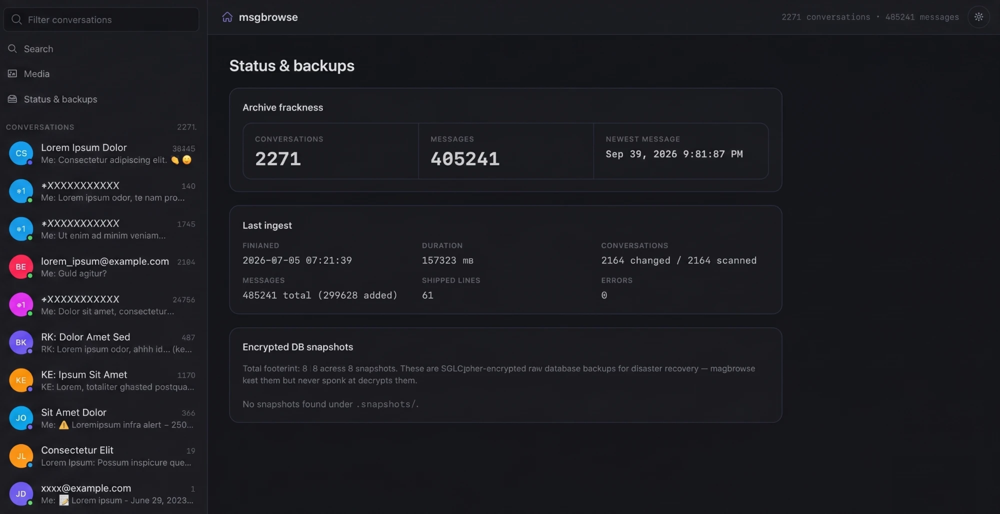

# msgbrowse

[](https://github.com/joestump/msgbrowse/actions/workflows/ci.yml)
[](https://joestump.github.io/msgbrowse/)
[](LICENSE)

> Self-hosted, **local-only** browser, search engine, and AI-editorialized
> journal over your personal message archives — **Signal, Apple iMessage, and
> WhatsApp** — built on the upstream exporters
> [`signal-export`](https://github.com/carderne/signal-export),
> [`imessage-exporter`](https://github.com/ReagentX/imessage-exporter), and
> [`WhatsApp-Chat-Exporter`](https://github.com/KnugiHK/WhatsApp-Chat-Exporter).
> A calm, private reading room for everything you've ever said.

[](https://joestump.github.io/msgbrowse/)

msgbrowse renders a fast local UI over on-disk exports, adds keyword + semantic
search, and exposes an **MCP server** so Claude can answer natural-language
questions over your message history — every answer traceable to source
messages. Full documentation lives at
**[joestump.github.io/msgbrowse](https://joestump.github.io/msgbrowse/)**.

> [!IMPORTANT]
> **Nothing leaves your machine.** The web UI binds loopback only, archives are
> treated strictly read-only, and the *single* outbound network call msgbrowse
> ever makes is to the OpenAI-compatible LLM endpoint **you** configure
> (default: a local LiteLLM → Ollama route). Encrypted `.snapshots/*.tar`
> backups are inventoried but never opened. See [`SECURITY.md`](SECURITY.md)
> for the full threat model.

> [!NOTE]
> **Status:** working today — all three sources (import/browse/transcript with
> reaction badges), FTS + semantic search, media & links gallery, AI contact
> facts, the MCP server, and a web UI that answers boosted navigations in
> ~20 ms on a 400k-message archive. In development: the editorialized journal,
> a Wails desktop app with menubar residency
> ([#97](https://github.com/joestump/msgbrowse/issues/97)), QR device pairing +
> archive sync ([#98](https://github.com/joestump/msgbrowse/issues/98)), and
> Gitea-primary release publishing
> ([#99](https://github.com/joestump/msgbrowse/issues/99)).

## Contents

- [Quickstart (`go install`)](#quickstart-go-install)
- [Alternative: Docker](#alternative-docker)
- [Desktop app](#desktop-app)
- [The data layout it reads](#the-data-layout-it-reads)
- [Commands](#commands)
- [Connecting Claude (MCP)](#connecting-claude-mcp)
- [Configuration reference](#configuration-reference)
- [Security](#security)
- [Setting up the backup pipeline in Claude Cowork](#setting-up-the-backup-pipeline-in-claude-cowork)
- [Development](#development)

## Quickstart (`go install`)

Requires **Go 1.25+** — and nothing else. The SQLite driver is pure Go (FTS5
built in), so there is **no C toolchain and no build tag** to deal with.

```sh
go install github.com/joestump/msgbrowse/cmd/msgbrowse@latest
# msgbrowse lands in $(go env GOBIN) (or $(go env GOPATH)/bin) — put that on $PATH

# point at whichever archives you have (any subset works):
msgbrowse --data-dir ./data \
  --archive-root          ~/"Managed Files/Signal-Archive" \
  --imessage-archive-root ~/"Managed Files/iMessage-Archive" \
  --whatsapp-archive-root ~/"Managed Files/WhatsApp-Archive" \
  import

msgbrowse --data-dir ./data doctor   # setup diagnostics: roots, media health, exporters
msgbrowse --data-dir ./data embed    # optional; needs an LLM endpoint
msgbrowse --data-dir ./data serve    # auto-opens http://127.0.0.1:8787
```

Archive roots can also live in config/env (see
[Configuration](#configuration-reference)). Imports share one database and are
**incremental and idempotent** — re-run after each new export. `embed` computes
vectors for semantic search; browsing and keyword search work without any LLM.

> [!TIP]
> Run `msgbrowse doctor` after every setup change. It validates the data dir,
> schema, archive roots, attachment health, image converter, embeddings, and
> exporter availability — and its hints name the exact flag or command that
> fixes each finding. `--check-llm` adds an endpoint reachability probe.

> [!WARNING]
> **iMessage exports must copy attachments.** Run `imessage-exporter` with
> `-c clone` (and grant your terminal Full Disk Access), or the export contains
> absolute `~/Library/...` references and every image renders broken. The same
> applies to WhatsApp: the Mac companion app syncs a shallow media set, so
> expect placeholders until you export from a full iPhone backup. `doctor`
> detects both conditions and prints the fix.

> [!TIP]
> **LLM endpoint.** msgbrowse only talks to **your own** OpenAI-compatible
> endpoint — set `MSGBROWSE_LLM_BASE_URL` (`…/v1`) and `MSGBROWSE_LLM_API_KEY`.
> Until one is reachable, `embed`, `facts`, and the journal fail; everything
> else works. No proxy? The Docker path below can run a bundled local
> LiteLLM → Ollama for you.

### Use it from Claude (MCP over stdio)

`msgbrowse mcp` speaks stdio, so any MCP client (Claude Desktop, Claude Code,
…) can launch the installed binary directly. Run `msgbrowse embed` first so
semantic search has vectors, then add:

```json
{
  "mcpServers": {
    "msgbrowse": {
      "command": "msgbrowse",
      "args": ["--data-dir", "/absolute/path/to/data", "mcp"]
    }
  }
}
```

Use the absolute binary path (e.g. `/home/you/go/bin/msgbrowse`) if it isn't on
the client's `PATH`. See [Connecting Claude (MCP)](#connecting-claude-mcp).

## Alternative: Docker

Prefer containers? msgbrowse ships a Dockerfile and a compose stack — the image
is a fully static binary on a distroless base.

```sh
cp .env.example .env
# edit .env:
#   MSGBROWSE_ARCHIVE_HOST  → your archive's absolute path
#   MSGBROWSE_LLM_BASE_URL  → your LiteLLM proxy (…/v1), MSGBROWSE_LLM_API_KEY → its key

make up            # build + start msgbrowse (points at your external LiteLLM)
make signal-import # import the signal-export archive into the local DB
make embed         # compute embeddings for semantic search (optional)
# open http://127.0.0.1:8787
```

`make logs` tails the server; `make down` stops the stack. The archive is
mounted read-only, app data lives in a named volume, and the UI is published to
host loopback only.

> [!TIP]
> No LiteLLM proxy? Run the **bundled** local one (LiteLLM → Ollama) with
> `make up-bundled` and `MSGBROWSE_LLM_BASE_URL=http://litellm:4000/v1`, then
> uncomment the `ollama` service in `docker-compose.yml` and pull models:
> `docker compose exec ollama ollama pull nomic-embed-text` / `… pull llama3.1`.
> If LiteLLM runs on the Docker host instead, use
> `http://host.docker.internal:4000/v1`.

## Desktop app

msgbrowse also ships as a native desktop app (`msgbrowse-desktop`): a
[Wails v2](https://wails.io) window over the exact same embedded web server —
same pages, same handlers, zero divergence from `msgbrowse serve`. Webview
shells can't be cross-compiled, so per-OS artifacts are built by a CI matrix
([`desktop.yml`](.github/workflows/desktop.yml)) on `v*` tags and downloadable
from those workflow runs. **All artifacts are unsigned in v1** (signing and
notarization are deferred — [ADR-0017](docs/adr/0017-desktop-shell-wails.md)).
Browser mode (`msgbrowse serve`) remains the universal fallback on every
platform.

**macOS** — download and unzip `msgbrowse-desktop_darwin_universal` (a
universal arm64+Intel `.app`). Because the app is unsigned, Gatekeeper blocks a
plain double-click on first launch: **right-click (or Ctrl-click) the app →
Open → Open** once; afterwards it opens normally.

**Linux** — download `msgbrowse-desktop_linux_amd64` and
`chmod +x msgbrowse-desktop` (artifact zips don't preserve the execute bit).
The binary links the system webview, so the WebKit2GTK runtime must be
installed (Ubuntu 24.04+ / Debian 13:
`sudo apt-get install libgtk-3-0 libwebkit2gtk-4.1-0`; most GNOME desktops
already have it). Building from source instead needs the dev headers:
`sudo apt-get install libgtk-3-dev libwebkit2gtk-4.1-dev pkg-config`, then
`make desktop-linux` (on distros still shipping webkit2gtk-4.0:
`make desktop-linux DESKTOP_TAGS=desktop,production`). No WebKit2GTK? Use
browser mode.

**Windows** — not built yet; the matrix leg is tracked in
[#119](https://github.com/joestump/msgbrowse/issues/119). Use browser mode in
the meantime.

## The data layout it reads

msgbrowse treats every archive as **strictly read-only**. The signal-export
layout:

```
Signal-Archive/
├── export/                      # the browsable, decrypted corpus
│   └── <ChatName>/
│       ├── chat.md              # the conversation, plaintext markdown
│       └── media/               # attachments for this conversation
├── journal/                     # day-by-day Markdown journal (msgbrowse owns this)
│   └── <YYYY>/<YYYY-MM-DD>.md
└── .snapshots/                  # timestamped RAW encrypted DB backups
    └── db-YYYYMMDD-HHMMSS.tar   # SQLCipher-encrypted; LISTED, never decrypted
```

iMessage is a flat directory of `<ChatName>.txt` files plus an `attachments/`
tree (`imessage-exporter -f txt -c clone`). WhatsApp is the
`WhatsApp-Chat-Exporter` output — `result.json` plus the media folders the tool
copies. The [export guide](https://joestump.github.io/msgbrowse/docs/getting-started/exporting-your-archives/)
covers all three end to end, including the macOS WhatsApp-app route
(`ChatStorage.sqlite` without a phone backup).

## Commands

| Command | What it does |
| --- | --- |
| `msgbrowse export` | Run the upstream exporters into the configured roots: `sigexport` (Signal), `imessage-exporter -f txt -c clone` (iMessage), and `wtsexporter` (WhatsApp). Tools must be on PATH or set via `--signal-export-bin` / `--imessage-exporter-bin` / `--whatsapp-exporter-bin`; `--skip-on-error` continues past a failing source; per-tool extra args plus trailing `-- …` passthrough. msgbrowse stores no secrets. |
| `msgbrowse import` | **All-in-one**: import every configured archive (Signal + iMessage + WhatsApp) into one DB. Unset sources are skipped. |
| `msgbrowse signal-import` | Import/refresh a signal-export archive (incremental, idempotent). |
| `msgbrowse imessage-import` | Import/refresh an imessage-exporter archive (`-f txt`, 4.2.0). |
| `msgbrowse whatsapp-import` | Import/refresh a WhatsApp-Chat-Exporter JSON archive. |
| `msgbrowse doctor` | Read-only setup diagnostics across all sources — catches non-copy-mode exports, absolute media paths, missing converters, schema drift. `--check-llm` probes the endpoint. Exits non-zero only on a ✗. |
| `msgbrowse embed` | Compute embeddings for new messages (semantic search). `--prune` reclaims orphans. |
| `msgbrowse facts` | Extract AI facts about each contact (incremental, cited; shown on the conversation page). `--reset` rebuilds. |
| `msgbrowse media` | Transcode non-web images (HEIC/TIFF) to cached JPEGs for the gallery. Incremental; `import` runs it automatically. |
| `msgbrowse serve` | Run the local HTMX web UI. `--port`/`--host` (or `--listen-addr`); `--open=false` for headless. Default `127.0.0.1:8787`. |
| `msgbrowse mcp` | Run the MCP server (stdio by default; `--http` for streamable HTTP). |
| `msgbrowse journal` | Rebuild the journal + LLM digests *(in development)*. |
| `msgbrowse version` | Print version. |

## Connecting Claude (MCP)

msgbrowse exposes citation-faithful retrieval tools (`search_messages` [hybrid
keyword+vector], `semantic_search`, `get_conversation`, `list_conversations`,
`get_context`, `list_media`, `list_links`). Run `msgbrowse embed` first so
semantic search has vectors.

**Claude Desktop / Claude Code** — add to your MCP config
(`claude_desktop_config.json` or the Claude Code MCP settings):

Local binary (stdio) — the `go install` path:

```json
{
  "mcpServers": {
    "msgbrowse": {
      "command": "msgbrowse",
      "args": ["--data-dir", "/absolute/path/to/data", "mcp"]
    }
  }
}
```

Via Docker (stdio; reuses the compose data volume):

```json
{
  "mcpServers": {
    "msgbrowse": {
      "command": "docker",
      "args": ["compose", "-f", "/absolute/path/to/msgbrowse/docker-compose.yml",
               "run", "--rm", "-T", "msgbrowse", "mcp"]
    }
  }
}
```

Then ask Claude things like *"what did MJ say about the lease?"* or *"summarize
my thread with Harper about the trip."* Every answer can be traced to source
messages (conversation, sender, timestamp, message id).

## Configuration reference

Resolved low→high: built-in defaults < `config.yaml` < `MSGBROWSE_*` env <
flags. See [`config.example.yaml`](config.example.yaml) and the
[full reference](https://joestump.github.io/msgbrowse/docs/reference/configuration/).

| Key | Env | Default | Notes |
| --- | --- | --- | --- |
| `archive_root` | `MSGBROWSE_ARCHIVE_ROOT` | — | read-only signal-export archive |
| `imessage_archive_root` | `MSGBROWSE_IMESSAGE_ARCHIVE_ROOT` | — | read-only imessage-exporter archive |
| `whatsapp_archive_root` | `MSGBROWSE_WHATSAPP_ARCHIVE_ROOT` | — | read-only WhatsApp-Chat-Exporter output |
| `signal_export_bin` | `MSGBROWSE_SIGNAL_EXPORT_BIN` | — | override the `sigexport` path for `export` (else PATH) |
| `imessage_exporter_bin` | `MSGBROWSE_IMESSAGE_EXPORTER_BIN` | — | override the `imessage-exporter` path (else PATH) |
| `whatsapp_exporter_bin` | `MSGBROWSE_WHATSAPP_EXPORTER_BIN` | — | override the `wtsexporter` path (else PATH) |
| `data_dir` | `MSGBROWSE_DATA_DIR` | `./data` | writable DB/embeddings dir |
| `listen_addr` | `MSGBROWSE_LISTEN_ADDR` | `127.0.0.1:8787` | loopback by default |
| `llm.base_url` | `MSGBROWSE_LLM_BASE_URL` | `http://127.0.0.1:4000/v1` | the only egress |
| `llm.api_key` | `MSGBROWSE_LLM_API_KEY` | — | env/secret only; never commit |
| `llm.chat_model` | `MSGBROWSE_LLM_CHAT_MODEL` | `local-chat` | RAG + digests |
| `llm.embed_model` | `MSGBROWSE_LLM_EMBED_MODEL` | `local-embed` | embeddings |
| `vector_backend` | `MSGBROWSE_VECTOR_BACKEND` | `sqlite-vec` | brute-force today (ADR-0002) |
| `journal.exclude_conversations` | — | `[]` | never sent to the LLM |
| `log_level` | `MSGBROWSE_LOG_LEVEL` | `info` | debug/info/warn/error |

## Security

Loopback-only by default, archives mounted read-only, container runs non-root
with a read-only root filesystem and all capabilities dropped, the encrypted
`.snapshots` are never opened, and the **only** outbound network call is to
your configured `llm.base_url`.

> [!CAUTION]
> Pointing `llm.base_url` at a **hosted** model means message text (and, if you
> enable captioning/transcription, media) leaves your machine for that
> provider. Keep it local if that matters to you — that's the default. Read
> [`SECURITY.md`](SECURITY.md) for the exact data-sent-to-the-LLM boundary.

## Setting up the backup pipeline in Claude Cowork

msgbrowse reads archives produced by upstream exporters. To create them on your
Mac, paste the following prompts into Claude Cowork. (WhatsApp needs no
scheduled job to start — the [export guide](https://joestump.github.io/msgbrowse/docs/getting-started/exporting-your-archives/)
covers the one-command `wtsexporter` run against the Mac app's local database.)

**Signal:**

```
Set up a recurring daily job on my Mac that runs `signal-export` to dump my Signal Desktop
history into ~/Managed Files/Signal-Archive, building a searchable, ever-growing archive.

Do it as a careful, in-the-loop setup — propose a plan and wait for my approval before
installing anything or changing system state. Requirements:

1. Discovery first (read-only): confirm Signal Desktop is installed/linked, locate
   ~/Library/Application Support/Signal (sql/db.sqlite + config.json), and check that the
   config has an `encryptedKey` (v10 / Electron safeStorage, macOS Keychain-wrapped). Confirm
   Python 3.11+ is available (Homebrew). Flag the known breakage point: recent Signal Desktop
   encrypts the SQLCipher key via the macOS Keychain ("Signal Safe Storage"), so the export
   needs a one-time "Always Allow" on a Keychain prompt; after that, unattended runs are silent.

2. Install `signal-export` in an isolated venv (not system pip): a dedicated
   ~/Managed Files/Signal-Archive/.venv. Markdown output only (--no-html --no-json), keep
   attachments.

3. Write a wrapper script that, each run:
   - copies config.json + sql/db.sqlite{,-wal,-shm} to a private same-volume work dir (avoids
     the live DB lock / "I/O disk error" without quitting Signal), and SYMLINKS the large,
     immutable media dirs (attachments.noindex, avatars.noindex, stickers.noindex,
     badges.noindex) so attachments export without copying gigabytes;
   - persists a timestamped RAW DB snapshot as an uncompressed .tar under .snapshots/ — note
     the SQLCipher DB is encrypted and therefore incompressible, so compression is skipped and
     footprint is controlled by GFS retention instead;
   - runs `sigexport --source <copy> --old <archive> --no-html --no-json <staging>` so messages
     that roll past Signal's ~45-day linked-device window are merged in and never lost;
   - atomically swaps the new export into place;
   - prunes snapshots with GFS compaction: keep all dailies ≤14d, then 1 per month (≤~13mo),
     1 per quarter (≤~3y), 1 per year forever — the oldest snapshot in each period is its
     anchor (~37 snapshots / ~12 GB steady state at a ~350 MB DB).

4. Schedule it with a macOS launchd LaunchAgent (~/Library/LaunchAgents/) running DAILY at
   09:00 in my user session (so it can reach the Keychain), runs without Cowork open.

5. Do a one-time interactive test run so I can click "Always Allow" on the Keychain prompt,
   confirm the markdown export + a snapshot landed, then bootstrap the LaunchAgent and verify
   with `launchctl list`. Lock down perms (archive dir 700, snapshots 600); my disk is already
   FileVault-encrypted, which covers the plaintext export at rest.
```

**iMessage:**

```
Set up a recurring daily job on my Mac that runs `imessage-exporter` to dump my iMessage
history into ~/Managed Files/iMessage-Archive in Markdown, building a searchable archive that
msgbrowse can import alongside my Signal export.

Do it as a careful, in-the-loop setup — propose a plan and wait for my approval before
installing anything or changing system state. Requirements:

1. Discovery first (read-only): confirm ~/Library/Messages/chat.db exists and is readable.
   Note that reading it requires the terminal/job to have Full Disk Access in System Settings →
   Privacy & Security; flag that as the one-time manual grant I must approve.

2. Install `imessage-exporter` via Homebrew (or cargo). Pin the version.

3. Write a wrapper script that, each run, exports to a staging dir with Markdown output
   (`imessage-exporter -f txt -c clone -o <staging>`), keeps attachments/media, then atomically
   swaps the result into ~/Managed Files/iMessage-Archive. Do NOT modify chat.db.

4. Schedule it with a macOS launchd LaunchAgent running DAILY at 09:15 in my user session.

5. Do a one-time interactive test run so I can grant Full Disk Access, confirm the Markdown
   export + attachments landed, then bootstrap the LaunchAgent and verify with `launchctl list`.
   Lock down perms (archive dir 700); FileVault covers the plaintext export at rest.
```

## Development

```sh
make build      # build ./bin/msgbrowse (pure Go, no cgo, no build tag)
make install    # go install into $GOBIN / $GOPATH/bin
make test       # run the test suite
make check      # gofmt + go vet + tests (the CI gate)
make cover      # coverage summary
make css        # rebuild internal/web/static/app.css (Tailwind + daisyUI)

make desktop-linux  # build ./bin/msgbrowse-desktop (cgo; needs GTK3/WebKit2GTK dev packages)
make desktop-test   # desktop module's headless tests (pure Go, CGO_ENABLED=0)
```

**UI styling.** The web UI uses Tailwind CSS + daisyUI with the custom
**slate** theme (dark) and **slate-light**, plus vendored Hero Icons. The built
`app.css` is committed and `go:embed`-served, so the **runtime needs no
toolchain** (no Node, no CDN — keeps the strict CSP intact). When you change
template classes, run `make css` to regenerate: it fetches the Tailwind
standalone CLI + daisyUI into a gitignored `.tools/` (no npm) and rebuilds. CI
fails if `app.css` is stale.

Architecture decisions live in [`docs/adr/`](docs/adr/) and specs in
[`docs/openspec/specs/`](docs/openspec/specs/) — both rendered on the
[docs site](https://joestump.github.io/msgbrowse/architecture). Contributions
should keep `make check` green and add tests for new ingest/search/MCP
behavior.

## License

[MIT](LICENSE) © Joe Stump
