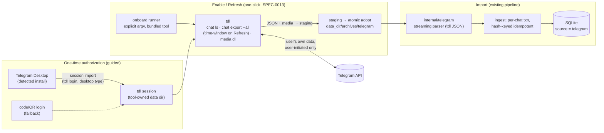

# ADR-0022: Telegram as a fourth source via a delegated exporter (tdl)

- **Status:** Accepted
- **Date:** 2026-07-06
- **Deciders:** Joe Stump
- **Related:** [ADR-0003 (dual-source archive)](0003-dual-source-archive.md), [ADR-0016 (WhatsApp source)](0016-whatsapp-source-exporter.md), [ADR-0020 (bundled exporters + guided setup)](0020-bundled-exporters-guided-setup.md), [ADR-0015 (onboarding: doctor/export/sync)](0015-onboarding-doctor-export-sync.md), [ADR-0010 (security & privacy posture)](0010-security-privacy-posture.md)

## Context and Problem Statement

msgbrowse imports three sources today, and all three follow the same idiom:
**msgbrowse does not write exporters.** Extraction is delegated to a
dedicated, provider-targeted upstream tool — `signal-export` for Signal,
`imessage-exporter` for iMessage, `WhatsApp-Chat-Exporter` for WhatsApp — and
msgbrowse's competence is ingesting what those tools produce: detection,
guided setup, invocation with explicit argv, incremental hash-keyed import,
and every downstream surface. Telegram is the most requested fourth source.
Which upstream exporter do we delegate Telegram extraction to, and how does it
fit the bundled-toolchain and no-credential-custody posture?

An earlier draft of this ADR proposed parsing Telegram Desktop's in-app
export (`result.json`) directly. That was rejected in review because it
violates the delegation idiom: msgbrowse itself would own the provider-format
extraction relationship, becoming the exporter. This revision reinstates the
idiom as a first-class invariant and selects a delegated tool instead.

## Decision Drivers

* **Exporter-delegation idiom (house invariant)**: msgbrowse MUST NOT
  implement provider extraction. Per-provider data extraction is always
  delegated to a dedicated upstream tool whose output msgbrowse ingests. This
  keeps provider-format churn, protocol details, and acquisition edge cases in
  tools purpose-built for them — and keeps msgbrowse a reader of files on
  disk.
* **No credential custody by msgbrowse** (SPEC-0013 invariant): exporters own
  their provider relationships, including any session state — precedent:
  `signal-export` uses Signal Desktop's OS-keychain-protected key material;
  msgbrowse never touches it.
* **Bundled-toolchain fit** (ADR-0020): the tool must bundle into
  `Contents/Resources/tools`, be version- and checksum-pinned, and inherit the
  signing/notarization pipeline.
* **Onboarding coherence** (SPEC-0013): detect → guide → one-click
  Enable/Refresh, with honest guided steps where the provider demands them.
* **Maintenance reality**: prefer an actively maintained tool with real
  adoption over small or archived projects.

## Considered Options

* **Delegate to `tdl` (iyear/tdl)** — Go, single static binary, ~7.7k stars,
  actively maintained; `tdl chat export` to JSON with time-window filters,
  media download, session importable from an installed Telegram Desktop
  client.
* **Delegate to a Telethon-based Python exporter** (`telegram-export`,
  `telegram-messages-dump`, and the small tools under the
  `telegram-exporter` GitHub topic).
* **Parse Telegram Desktop's native in-app export directly in msgbrowse**
  (the rejected earlier draft).
* **Implement an in-house MTProto client** (e.g. on `gotd/td`).

## Decision Outcome

Chosen option: **"Delegate to `tdl`"**, because it is the strongest
delegation-idiom fit in the Telegram ecosystem: a purpose-built, actively
maintained exporter that ships as a single static Go binary (bundles exactly
like `imessage-exporter`), exports chats to machine-readable JSON with
**time-window filters that give Telegram genuinely incremental exports** (the
other three sources all re-export in full), downloads referenced media, and
manages its own Telegram session — including a non-interactive session import
from an installed Telegram Desktop client, which is precisely the machine
msgbrowse's detection already targets.

The idiom this reinforces, stated once for the record: **msgbrowse never
writes exporters.** New sources are added by selecting and integrating an
upstream exporter, never by teaching msgbrowse a provider's raw formats or
protocols.

### Consequences

* Good, because the delegation idiom holds four sources wide: provider-format
  churn is `tdl`'s problem (absorbed by our version pin + fixtures), not a
  parser rewrite in msgbrowse.
* Good, because Enable/Refresh become one-click like Signal/iMessage — the
  tool runs unattended once authorized, and time-window export makes Refresh
  cheap even on huge accounts.
* Good, because credential posture is preserved by construction: the session
  lives in `tdl`'s own data directory, created by a one-time guided
  authorization (primary path: import from the detected Telegram Desktop
  client); msgbrowse never reads, stores, or logs it.
* Good, because bundling is the known ADR-0020 shape: one more pinned,
  checksummed, signed binary — no Python venv additions.
* Bad, because the signing/notarization scope grows by one third-party
  binary, and we take a supply-chain dependency on `tdl` releases (mitigated
  by sha256 pinning and the #140 checksum discipline).
* Bad, because export now performs **network egress to Telegram's API** (the
  user's own account data, via the user's own session, only during
  user-initiated Enable/Refresh). This amends ADR-0010's "LLM endpoint is the
  sole egress" framing the same way ADR-0021 amended it for LAN sync — the
  qualification must ride along in SECURITY.md and the ADR-0010 prose.
* Bad, because authorization is a real step: session import from Telegram
  Desktop can require the client's local passcode, and accounts without
  Telegram Desktop need an interactive code/QR login fallback. The guided
  flow must be honest about this (WhatsApp's iPhone-backup leg set the
  precedent for honest friction).
* Bad, because very large first exports can hit Telegram flood-wait limits —
  `tdl` implements backoff, but first-run duration is provider-throttled and
  progress surfacing matters.

### Confirmation

SPEC-0015 (Telegram source) governs the requirements. Compliance is confirmed
by: the delegation invariant asserted in the spec (no extraction code in
msgbrowse; the exporter is invoked with explicit argv from the bundled,
pinned toolchain); parser unit tests over synthetic fixtures of `tdl`'s JSON
output; detection/authorization/guidance tests in `internal/setup`; doctor
coverage; CI bundle pinning + relocation probes per ADR-0020; and the
standard `CGO_ENABLED=0` build/vet/test gates.

## Pros and Cons of the Options

### Delegate to `tdl` (chosen)

* Good, because active (7.7k★, releases through 2026), purpose-built, and a
  single static Go binary — the cheapest possible ADR-0020 bundle addition.
* Good, because JSON export with `--all`, time-window (`-T time`) and
  id-range filters: real incremental Refresh.
* Good, because session import from an installed Telegram Desktop client
  makes first-run authorization non-interactive on exactly the machines our
  detection finds.
* Neutral, because its JSON schema is its own — our parser targets `tdl`
  output pinned by version, with tolerant decoding for drift between pins.
* Bad, because one more third-party binary in the signing scope and
  supply chain.

### Delegate to a Telethon-based Python exporter

* Good, because the Python-venv bundling lane already exists (ADR-0020:
  signal-export, wtsexporter).
* Bad, because the candidates are effectively unmaintained or tiny
  (`telegram-export` archived; the `telegram-exporter` GitHub topic lists
  only zero-star projects as of 2026-07) — a poor maintenance bet for a
  privacy product's supply chain.
* Bad, because interactive-first login flows and heavier runtime for no
  capability `tdl` lacks.

### Parse Telegram Desktop's native export directly in msgbrowse (rejected earlier draft)

* Good, because zero new binaries and zero session handling anywhere.
* Bad, because it **violates the exporter-delegation idiom** — msgbrowse
  becomes the exporter, owning a provider's informally versioned raw format
  and its churn forever. This is the reason it was rejected in review.
* Bad, because acquisition stays manual (in-app export each time; no
  one-click Enable/Refresh, no incrementality).

### In-house MTProto client (`gotd/td`)

* Good, because pure Go and maximal integration ceiling.
* Bad, because it is the idiom violation in its strongest form — msgbrowse
  would BE a Telegram client, with the full protocol, session, and ToS
  surface in-tree. Rejected outright.

## Architecture Diagram

## More Information

`tdl` (https://github.com/iyear/tdl, https://docs.iyear.me/tdl/): export
command shape `tdl chat export -c <chat> --all` producing JSON
(per-message id, date, sender, text, media references); `-T time -i
<start>,<end>` for incremental windows; media downloaded via the companion
download command over the export manifest; chats enumerated with
`tdl chat ls`. Exact flags and JSON schema are pinned per bundled version and
verified by fixtures — the implementation confirms them against the pinned
release, not this ADR.
