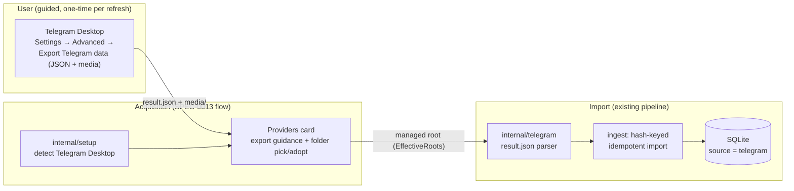

# ADR-0022: Telegram as a fourth source via Telegram Desktop's native JSON export

- **Status:** Accepted
- **Date:** 2026-07-06
- **Deciders:** Joe Stump
- **Related:** [ADR-0003 (dual-source archive)](0003-dual-source-archive.md), [ADR-0016 (WhatsApp source)](0016-whatsapp-source-exporter.md), [ADR-0015 (onboarding: doctor/export/sync)](0015-onboarding-doctor-export-sync.md), [ADR-0020 (bundled exporters + guided setup)](0020-bundled-exporters-guided-setup.md), [ADR-0010 (security & privacy posture)](0010-security-privacy-posture.md)

## Context and Problem Statement

msgbrowse imports three sources today, each through an upstream exporter it can
run on the user's behalf: `signal-export` (Signal), `imessage-exporter`
(iMessage), and `WhatsApp-Chat-Exporter` (WhatsApp). Telegram is the most
requested fourth source, but it inverts the acquisition problem: there is no
trustworthy third-party exporter that reads an on-disk database (Telegram
Desktop's local `tdata` store is encrypted and deliberately undocumented),
while Telegram Desktop itself ships a first-party export feature (Settings →
Advanced → Export Telegram data) that writes a machine-readable
`result.json` plus media directories. How should msgbrowse acquire and import
Telegram history without compromising its no-credentials, read-only-archive
posture?

## Decision Drivers

* **No credential custody** (SPEC-0013 invariant): msgbrowse never stores or
  proxies account secrets; exporters run against local data only.
* **Read-only archive posture** (ADR-0010): the source of truth is a folder of
  files the user controls; msgbrowse never mutates it.
* **Bundle weight and signing surface** (ADR-0020): every binary added to the
  `.app` inherits the signing/notarization obligation and bloats the download.
* **Onboarding coherence** (SPEC-0013): sources surface as Providers cards with
  detect → guide → import flows; WhatsApp already established the
  "guided manual step" pattern (export from an iPhone backup).
* **Format stability**: whatever we parse must be testable against synthetic
  fixtures and tolerant of upstream drift.

## Considered Options

* **Parse Telegram Desktop's native JSON export** (`result.json` + media dirs)
* **Bundle a third-party MTProto exporter** (e.g. `tdl`, `telegram-backup`)
* **Implement an in-house MTProto client** (e.g. on `gotd/td`)

## Decision Outcome

Chosen option: **"Parse Telegram Desktop's native JSON export"**, because it is
the only acquisition path with zero credential custody and zero new bundled
binaries: the user runs a first-party, supported export inside Telegram
Desktop, and msgbrowse treats the resulting folder exactly like every other
archive root — detected, guided, adopted into a managed root, and imported
incrementally by content hash. This mirrors the WhatsApp decision (ADR-0016):
when one-click export is impossible without secrets, prefer a guided manual
acquisition over holding keys.

### Consequences

* Good, because msgbrowse never sees a Telegram credential, session, or API
  key — the MTProto attack/maintenance surface simply does not exist here.
* Good, because nothing new ships in the `.app`: no added binary, no added
  signing scope, no exporter version pinning (ADR-0020's toolchain is
  untouched).
* Good, because the import side reuses the whole existing pipeline: source
  enum + migrations allowed-source check, hash-keyed idempotent re-import,
  `EffectiveRoots` managed-root adoption, media/attachment resolution, FTS +
  embeddings.
* Bad, because Enable cannot run the export itself — onboarding is a guided
  flow ("run the export in Telegram Desktop, then point msgbrowse at the
  folder"), one notch more manual than Signal/iMessage. WhatsApp set this
  precedent and the Providers guidance machinery already supports it.
* Bad, because each Telegram export is a full re-export (Telegram Desktop has
  no incremental mode); import stays incremental via content hashes, but the
  user-side export step scales with history size.
* Bad, because secret chats are absent by design (device-bound E2E; Telegram
  Desktop does not export them) and the JSON schema is informally versioned —
  the parser must be tolerant (unknown fields ignored, malformed entries
  logged and skipped, never fatal) and pinned by versioned synthetic fixtures.

### Confirmation

SPEC-0015 (Telegram source) governs the requirements. Compliance is confirmed
by: parser unit tests over synthetic `result.json` fixtures (including entity
arrays, service messages, reactions, forwards, and malformed entries);
detection/guidance tests in `internal/setup`; doctor coverage; and the standard
CI gates (`CGO_ENABLED=0` build/vet/test).

## Pros and Cons of the Options

### Parse Telegram Desktop's native JSON export

The user triggers Export Telegram Data (JSON format, media included) in
Telegram Desktop; msgbrowse detects Telegram Desktop's presence, guides the
export, and imports the chosen folder.

* Good, because zero credentials, zero new binaries, zero new egress.
* Good, because it is the first-party, supported export path — least likely to
  break silently or violate terms of service.
* Good, because `result.json` is machine-readable and self-contained
  (`chats.list[].messages[]` with stable `id`, unix timestamps, typed `text`
  entities, relative media paths).
* Neutral, because cloud chats export with full history; secret chats do not
  (an honest, documentable limitation rather than a flaw).
* Bad, because the export step is manual and full-history each time.
* Bad, because the schema is documented only by observation; drift across
  Telegram Desktop releases must be absorbed by a tolerant parser.

### Bundle a third-party MTProto exporter (`tdl`, `telegram-backup`, …)

Ship an MTProto client in `Contents/Resources/tools` and drive it from Enable.

* Good, because one-click Enable → export → import would work like Signal.
* Bad, because MTProto login means holding `api_id`/`api_hash`, a phone-number
  login flow, 2FA, and a persistent session file — direct violation of the
  no-credential-custody invariant, and a rich target in a privacy product.
* Bad, because automated third-party clients carry real account-ban risk and
  ToS exposure that msgbrowse would be inflicting on its users.
* Bad, because it adds a binary to bundle, sign, notarize, pin, and re-verify
  every release (ADR-0020 obligations) for a tool with a small maintainer
  base.

### Implement an in-house MTProto client (`gotd/td`)

Integrate a pure-Go Telegram client library directly into msgbrowse.

* Good, because pure Go (no bundle addition) and deep integration would be
  possible (true incremental fetch).
* Bad, because every credential/session/ToS objection above applies, now with
  msgbrowse itself as the client — the maintenance surface of a full MTProto
  protocol implementation lands in a codebase whose privacy promise is "we
  read files you already have".
* Bad, because it is by far the largest engineering effort of the three for a
  fourth source.

## Architecture Diagram

## More Information

The export folder layout Telegram Desktop produces (observed, JSON format):
`result.json` at the root; media under relative directories such as `photos/`,
`video_files/`, `voice_messages/`, `files/`, and `stickers/`, referenced by
relative path from message objects. Message `text` is either a plain string or
an array of typed entities (`plain`, `link`, `mention`, `code`, …) that must be
flattened for storage and search. `service` messages (joins, pins, calls) map
to msgbrowse's `is_system`. Reactions appear in recent export versions and map
to the reaction handling introduced for Signal/iMessage.
