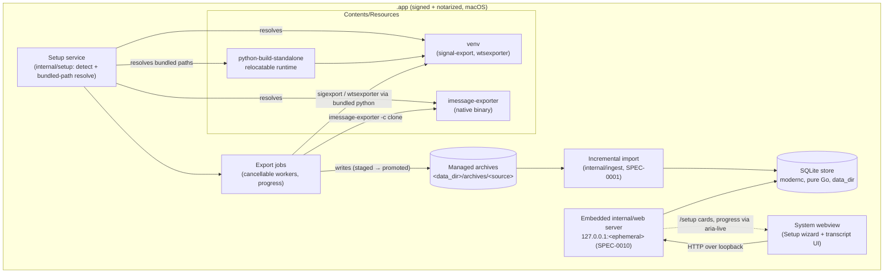

# SPEC-0013 Design: Desktop guided setup

## Context

[ADR-0015](../../../adr/0015-onboarding-doctor-export-sync.md) built the
onboarding machinery for a power user at a terminal: `doctor` detects setup
health, `export` orchestrates the three upstream exporters with correct flags
(iMessage in copy mode, WhatsApp into a managed root), and `sync` chains
export → import → media → embed → facts. Those building blocks already exist —
`internal/cli/doctor.go` holds the detection and health checks,
`internal/cli/export.go` the exporter wrappers, `internal/ingest` the
incremental importer, and `cmd/msgbrowse-desktop/internal/embedded` already
anchors the desktop `data_dir` to `os.UserConfigDir()/msgbrowse`.

This spec evolves that CLI onboarding into a **consumer surface**
([ADR-0020](../../../adr/0020-bundled-exporters-guided-setup.md)): the desktop
app detects which messaging apps you use and enables imports with a click, with
no terminal, no visible data dir, and no manual tool installs. The exporters
are bundled inside the `.app`. We reuse the detection, export, and import code
rather than reimplement it — the new work is (1) a shared detection package the
CLI and UI both call, (2) bundled-tool resolution, (3) a Setup web surface with
background export/import jobs, and (4) a signing/notarization release stage.

## Goals / Non-Goals

**Goals**

- Zero-terminal onboarding: download → double-click → click Enable per source.
- Bundled, offline toolchain: relocatable Python + prebuilt venv
  (`signal-export`, `wtsexporter`) + `imessage-exporter` under
  `Contents/Resources`, resolved by bundled path, never PATH.
- App-owned, hidden `data_dir` and managed archive roots
  (`<data_dir>/archives/<source>`); paths visible in About/Advanced, never
  required.
- Detect-and-guide OS consent (Full Disk Access, Signal Keychain, WhatsApp
  container) — never bypass it.
- One shared detection package (`internal/setup`) feeding both `doctor` and the
  UI.
- Reuse the existing export orchestration and incremental import unchanged.

**Non-Goals**

- **Scheduled / background auto-refresh in v1** (a launchd agent is a
  follow-on); Refresh is user-initiated only.
- **Linux/Windows bundling in v1** (AppImage/MSI + runtime embedding is an open
  question); those platforms keep browser mode and the CLI BYO path.
- **Mobile.**
- **Automating OS consent** — the app detects and guides, the user grants.

## Decisions

### Fully-bundled toolchain; paths resolve from the bundle

- **Choice:** the `.app` embeds a relocatable Python runtime, a prebuilt venv
  with `signal-export` and `whatsapp-chat-exporter`, and the `imessage-exporter`
  binary under `Contents/Resources`. In desktop mode a bundled-path resolver
  (in the new `internal/setup` package, given the bundle's resources dir)
  returns absolute paths to each tool and to the Python interpreter; the export
  jobs invoke those, never `exec.LookPath`.
- **Rationale:** this is the only option that is zero-terminal AND offline AND
  reproducible ([ADR-0020](../../../adr/0020-bundled-exporters-guided-setup.md)
  option (d)). The CLI's `resolveTool` (`internal/cli/export.go`) falls back to
  `LookPath`; the desktop path supplies an explicit override so the same
  `runExport` core drives bundled binaries with no reimplementation.
- **Alternatives:** detect-and-guide manual installs (not zero-terminal);
  pipx/brew on demand (needs network + a package manager); bundle the native
  binary but managed-install the Python tools (only one-third offline). All
  rejected in ADR-0020.

### Relocatable Python: python-build-standalone

- **Choice:** embed a **python-build-standalone** distribution and `pip
  install` `signal-export` and `whatsapp-chat-exporter` into a venv built
  against it, at bundle-build time in CI.
- **Rationale:** python-build-standalone produces a self-contained,
  relocatable interpreter designed to be moved into an arbitrary prefix — which
  is exactly what living under `Contents/Resources` and being signed +
  notarized requires. A venv on top pins the two exporters and their
  dependencies to hashes we control.
- **Alternatives:** the **system Python** (rejected — the whole point is not to
  depend on the user's machine; may be absent or wrong version); **PyInstaller
  (or similar) per tool** to freeze each exporter into its own executable
  (viable, but produces two opaque frozen bundles to sign and re-cut on every
  upstream bump, and complicates matching the exporters' own runtime
  expectations; a shared relocatable interpreter + venv is simpler to reason
  about and to notarize as one tree). python-build-standalone + venv is the
  recommendation; PyInstaller stays the documented fallback if relocation +
  signing of the standalone interpreter proves fragile on a given macOS
  version.

### Shared detection package: refactor `doctor` into `internal/setup`

- **Choice:** extract the detection/health logic from `internal/cli/doctor.go`
  into a reusable `internal/setup` package that returns structured per-source
  results (state ∈ Ready / Needs-permission / Not-detected / Enabled, plus the
  probed location and any permission gap). `doctor` renders those results as
  text lines; the web Setup handler renders them as cards.
- **Rationale:** SPEC-0013 requires the CLI and UI to detect from the *same*
  code (the "same three detections from the same shared code" scenario).
  Today's `doctor` mixes probing with text formatting (`report.add`); splitting
  the probe (pure, returns typed results) from the presentation lets both
  front-ends consume it and keeps `doctor`'s behavior byte-identical.
- **Alternatives:** duplicating the probes in the web layer (guaranteed drift —
  rejected); having the UI shell out to `doctor` and parse its text
  (brittle — rejected).

### Managed archive layout

- **Choice:** the app owns `<data_dir>/archives/{signal,imessage,whatsapp}` and
  writes each exporter only into its source's root; `data_dir` stays anchored
  to `os.UserConfigDir()/msgbrowse` (`embedded.resolveDataDir`). The three
  `*_archive_root` config keys are set to these computed paths in desktop mode;
  the CLI keeps accepting user-supplied roots.
- **Rationale:** the user never names a path
  ([ADR-0020](../../../adr/0020-bundled-exporters-guided-setup.md) decision (i)).
  Reusing the existing config keys means `export`/`import`/`doctor` need no new
  root plumbing — only the desktop app populates them itself.
- **Alternatives:** prompting for paths (rejects the consumer goal); a flat
  single archive dir (loses per-source containment the media path-guards rely
  on). Rejected.

### Same-origin protection for privileged setup POSTs

- **Choice:** each state-changing Setup POST (`/setup/enable`,
  `/setup/refresh`, `/setup/recheck`) requires BOTH a same-origin check (verify
  `Origin` / `Sec-Fetch-Site` against the embedded server's loopback origin)
  AND a per-session token minted at `/setup` render and submitted with the
  POST; failures return `403` before any subprocess starts. Bodies are capped
  with `http.MaxBytesReader`, and the only body field is a source enum — never
  a path.
- **Rationale:** these POSTs spawn a subprocess that reads a personal database
  and writes an archive — a privileged local action. Loopback alone is not
  enough: another local process, or a malicious page in the user's browser,
  could otherwise POST to `127.0.0.1:<port>/setup/enable`. The token +
  origin check make the exporter undrivable cross-origin even under loopback
  (ADR-0010's strict CSP `form-action 'self'` is a complement, not a
  substitute).
- **Alternatives:** loopback-only with no token (the read-only `/settings`
  posture — insufficient for a route that launches subprocesses); mutual TLS
  (the device-sync mechanism per SPEC-0011 — overkill for a same-machine POST).

### Signing / notarization pipeline

- **Choice:** the release matrix gains a macOS signing + notarization stage:
  sign every embedded executable (Python runtime, venv compiled extensions,
  `imessage-exporter`) with a Developer ID, sign the `.app`, then submit it to
  Apple's notary service and staple the ticket, as a step in the existing
  desktop CI matrix / release pipeline
  ([SPEC-0010](../desktop-shell/spec.md), [SPEC-0012](../release-publishing/spec.md)).
- **Rationale:** Gatekeeper refuses unsigned embedded binaries, so bundling
  makes signing non-optional — this is the amendment to
  [ADR-0017](../../../adr/0017-desktop-shell-wails.md).
- **Alternatives:** ship unsigned (Gatekeeper blocks the bundled exporters —
  rejected); ad-hoc signing (not notarizable, still blocked on download —
  rejected).

## Architecture

The bundle carries its own toolchain; the setup service drives export jobs into
the managed archives, then the existing importer loads them into the store the
web UI already serves.



The "Enable iMessage" flow shows the detect → guide → recheck consent loop and
the background export/import job:

```mermaid
sequenceDiagram
    actor User
    participant WV as Webview (Setup card)
    participant SVC as Setup service (/setup/*)
    participant OS as macOS (Full Disk Access)
    participant EXP as Bundled imessage-exporter
    participant ING as Incremental import
    participant DB as SQLite store

    User->>WV: Open Setup
    WV->>SVC: GET /setup (detect)
    SVC->>OS: Probe chat.db readability
    OS-->>SVC: Permission denied (no FDA)
    SVC-->>WV: iMessage = Needs-permission
    WV-->>User: FDA guidance + deep link + Recheck

    User->>OS: Grant Full Disk Access (System Settings)
    User->>WV: Click Recheck
    WV->>SVC: POST /setup/recheck (same-origin + token)
    SVC->>OS: Probe chat.db again
    OS-->>SVC: Readable
    SVC-->>WV: iMessage = Ready

    User->>WV: Click Enable
    WV->>SVC: POST /setup/enable {source: imessage} (same-origin + token)
    SVC->>SVC: Start supervised job (ctx, progress)
    SVC->>EXP: imessage-exporter -f txt -c clone -o <staging>
    EXP-->>SVC: progress… → done (exit 0)
    SVC->>SVC: Promote staging → managed root
    SVC->>ING: Import managed root (incremental)
    ING->>DB: Upsert conversations/messages
    DB-->>ING: N new
    ING-->>SVC: Imported N
    SVC-->>WV: aria-live: "Enabled — N conversations"
    WV-->>User: iMessage in sidebar; card = Enabled
```

## Risks / Trade-offs

- **App size (+80–120 MB).** The Python runtime + venv + native binary dwarf
  today's single-binary footprint. Accepted per ADR-0020; delta/size
  optimization (thinning the interpreter, stripping unused stdlib) is an open
  question, not a v1 blocker.
- **Notarization pipeline + Apple Developer ID.** New release surface: an
  Apple Developer ID (cost + provisioning), a notary submission + staple step,
  and signing of every embedded executable. Mitigation: a single signing stage
  in the desktop matrix; failures gate only the desktop release, not the core
  check.
- **Upstream exporter version drift + security re-bundle cadence.** We now own
  shipping security fixes for three third-party tools; a CVE in any of them
  means re-cutting the venv/binary, re-signing, and re-notarizing. Mitigation:
  pin + hash the venv build, track upstream releases, and treat a security bump
  as a normal patch release.
- **Bundled-Python supply chain.** An embedded interpreter and its dependency
  tree widen what ships inside the signed app. Mitigation: build the venv from
  pinned, hash-verified wheels in CI (see Open Questions on reproducibility);
  the whole tree is signed and notarized, so post-build tampering is detectable.
- **FDA UX friction is inherent and unavoidable.** macOS will not let any app
  grant itself Full Disk Access; the user must toggle it in System Settings and
  the app must be relaunched/rechecked. We can only detect and guide well — the
  round-trip is a fact of the platform, not a bug we can design away.

## Migration Plan

No schema, data, or config-key migrations — the store, the three
`*_archive_root` keys, and the archives are untouched, and the CLI path is
unchanged.

1. **`internal/setup` (new, pure Go):** refactor detection out of
   `internal/cli/doctor.go` into a shared package returning typed per-source
   results; rewire `doctor` to render them (behavior byte-identical) and add
   the bundled-path resolver. Testable headless with `CGO_ENABLED=0`.
2. **Setup web surface:** `/setup` (GET, cards) + `/setup/enable` /
   `/setup/refresh` / `/setup/recheck` (POST, same-origin + token) in
   `internal/web`, driving supervised export/import jobs that reuse
   `runExport` and `internal/ingest`; progress via `aria-live`. Served in
   browser mode too, but the bundled-tool path resolves only in the `.app`.
3. **Bundling build steps in the desktop CI matrix:** fetch
   python-build-standalone, build the pinned venv, place the tools under
   `Contents/Resources`, and wire the bundled-path resolver — a new stage in
   the SPEC-0010 desktop matrix.
4. **Signing + notarization stage:** sign every embedded executable, sign the
   `.app`, notarize, and staple — the amendment to ADR-0017.
5. **CLI unchanged:** advanced users keep BYO exporters and user-supplied
   roots; nothing in the core depends on the bundle.

Rollback at any step is deletion: the bundle and Setup surface are additive,
and browser mode plus the CLI onboarding remain the fallback.

## Open Questions

- **Linux/Windows bundling.** AppImage/MSI and their runtime-embedding +
  signing stories are undesigned; deferred per ADR-0020.
- **Scheduled / background refresh.** A launchd agent (and its XDG/Windows
  equivalents) to auto-refresh in the background is a v1 non-goal; when and how
  it lands is open.
- **Reproducible venv production in CI.** How to build the bundled venv
  deterministically (pinned + hash-verified wheels, a lockfile, a fixed
  python-build-standalone release) so two CI runs produce byte-comparable
  toolchains.
- **Apple Developer ID provisioning.** Who holds the Developer ID, where the
  signing identity + notary credentials live in CI secrets, and the rotation
  discipline.
- **Delta / size optimization.** Whether to thin the interpreter (strip unused
  stdlib, prune the venv) to claw back part of the +80–120 MB, and whether
  per-source lazy extraction is worth the complexity.
</content>
