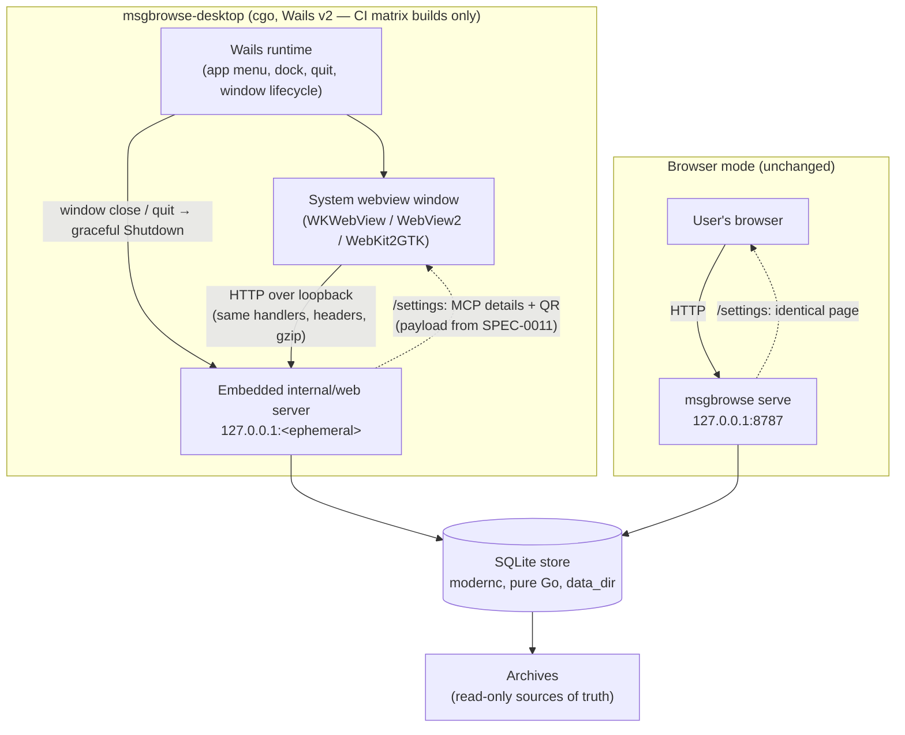

# SPEC-0010 Design: Desktop shell

## Context

The performance epic changed the calculus.
[SPEC-0008](../web-performance/spec.md) took the web UI from 1.8–2.9 s renders
to < 300 ms TTFB and **19 ms boosted navigations** on the reference archive —
the app now feels native, so wrapping it in a native window stops being
lipstick and starts being honest. The owner asked for a real desktop app (and
about Proton Native specifically;
[ADR-0017](../../../adr/0017-desktop-shell-wails.md) addresses it by name and
rejects it as unmaintained and wrong-stack). Today the closest thing is
`serve --open`, which launches a browser tab and leaves a terminal running.

The shell also gives the Connect story a home:
[SPEC-0011 (device sync)](../device-sync/spec.md) needs a place to show a
pairing QR and MCP connection details, and that place should exist in browser
mode too — it's a web page, not a desktop feature.

## Goals / Non-Goals

**Goals**

- A native desktop app (macOS first; Linux/Windows via the same code) hosting
  the existing UI unchanged.
- Core stays `CGO_ENABLED=0`
  ([ADR-0013](../../../adr/0013-pure-go-sqlite-driver.md)); cgo is quarantined
  in `cmd/msgbrowse-desktop`.
- A `/settings` Connect page served by the normal web app, with server-rendered
  QR (payload per SPEC-0011).
- CI-built per-OS artifacts.

**Non-Goals**

- Mobile apps (SPEC-0011 pairs desktop/server nodes; no mobile shell).
- Auto-update.
- Code signing / macOS notarization in v1 (deferred per ADR-0017).
- Wails JS bindings / a second frontend — the UI remains server-rendered
  HTMX over HTTP.

## Decisions

### Wails v2 as the shell

- **Choice:** Wails v2 wrapping the system webview around the embedded
  server, per ADR-0017.
- **Rationale:** Go-native, system webview (small artifacts), and batteries —
  menus, dock, packaging — that we'd otherwise hand-roll.
- **Alternatives:** Electron (Chromium+Node bundle — rejected), Tauri (Rust
  toolchain + Go sidecar supervision — rejected), webview/webview_go (kept as
  the documented minimal fallback; identical architecture, fewer batteries),
  Proton Native (unmaintained, React→libui, wrong stack — rejected),
  `serve --open` status quo (rejected as the end state). Full analysis in
  ADR-0017.

### Menubar residency via a systray companion library

- **Choice:** implement the "Menubar residency" and "Menubar quick menu"
  requirements with a maintained Go systray library (fyne-io/systray, the
  maintained fork of getlantern/systray) running alongside Wails v2 in the
  desktop process; window close is intercepted (Wails `OnBeforeClose`) to
  hide instead of quit.
- **Rationale:** Wails **v2 has no first-class systray API** (it arrives as a
  core feature in v3, still pre-stable). fyne-io/systray is cross-platform
  (macOS/Linux/Windows), cgo on macOS — acceptable, the desktop target is
  already cgo-isolated — and its menu-item model covers the quick menu
  (dynamic retitle for the "Copied" acknowledgment, enable/disable for
  degraded states). The MCP status line reads the embedded server's health
  directly in-process; clipboard writes use the shell's native clipboard API
  so they work with the window closed.
- **Alternatives:** waiting for Wails v3 systray (blocks a wanted feature on
  an alpha); a second helper process for the tray (IPC complexity for no
  gain); menubar-only via macOS-specific NSStatusItem bindings (loses
  Linux/Windows parity).

### Loopback HTTP on an ephemeral port, not the Wails asset handler

- **Choice:** the desktop process starts `internal/web`'s real `net/http`
  server on `127.0.0.1:0`, reads the bound port off the listener, and points
  the webview at `http://127.0.0.1:<port>/`.
- **Rationale:** zero divergence from the served app. The webview traverses
  the same listener, middleware, gzip, ETags, security headers, and HTMX
  behavior a browser does — every SPEC-0008 test and every future handler
  works in both modes without a second code path. An ephemeral port also
  can't collide with a concurrently running `msgbrowse serve` on 8787.
- **Alternatives:** Wails' AssetServer can dispatch requests to an
  `http.Handler` in-process with no TCP listener at all — attractive (no port,
  no socket), but it bypasses the real server path: middleware wiring,
  `Accept-Encoding` negotiation, and absolute-URL generation (the Connect
  page must display real URLs a *separate* MCP client can reach) would all
  diverge from browser mode. Rejected for v1; revisit only if the loopback
  listener itself becomes a problem.
- **Mechanics (as built):** Wails v2 has no first-class "open this external
  URL" option, so the asset handler serves exactly one thing: a static
  bootstrap trampoline (`<meta http-equiv="refresh">` to the discovered
  `http://127.0.0.1:<port>/`, no scripts, no styles, `default-src 'none'`
  CSP). The webview loads it once from the Wails scheme and immediately
  navigates to the embedded server; every request after that is ordinary
  loopback HTTP through `internal/web`. On the server side,
  `web.(*Server).Run` is split into `Listen` (bind, discover port) and
  `Serve` (block until context cancel, then `http.Server.Shutdown`) so
  `serve` and the shell share one lifecycle path; the shell wraps them in
  `cmd/msgbrowse-desktop/internal/embedded`, a pure-Go package that is
  unit-tested headless with `CGO_ENABLED=0`.

### Server-side QR rendering

- **Choice:** render the pairing QR on the server as a PNG `data:` URI
  embedded in the `/settings` template, using a pure-Go QR library
  (`skip2/go-qrcode` is the expected pick — a new dependency, noted and
  accepted; it must not drag in cgo).
- **Rationale:** the strict CSP (ADR-0010: `default-src 'none'`,
  `img-src 'self' data:`) already permits data-URI images and forbids inline
  script; a client-side QR library would add vendored JS for something the
  server can do in one function call, and server-side rendering works
  identically in browser mode. The QR payload is opaque to this spec —
  SPEC-0011 defines it; `/settings` just encodes the bytes it's handed.
- **Alternatives:** client-side JS QR generation (more moving parts, worse
  CSP story — rejected); a separate `/settings/qr.png` route (works, but a
  data URI keeps the page self-contained and adds no route — not needed
  unless payload size ever makes inline data URIs unwieldy).

### Build isolation: nested module + tags + CI matrix

- **Choice:** all Wails/cgo code sits in `cmd/msgbrowse-desktop`, which is
  its own Go module (`cmd/msgbrowse-desktop/go.mod`, with a
  `replace github.com/joestump/msgbrowse => ../..` directive) **and** whose
  files carry the `desktop` build tag; desktop binaries are built only by the
  desktop Makefile targets and the GitHub Actions matrix (macOS →
  `.app`/dmg, Ubuntu + WebKit2GTK → Linux, Windows → `.exe`).
- **Rationale:** webview shells cannot cross-compile, and ADR-0013's
  `CGO_ENABLED=0` core is sacred. Build tags alone gate *compilation* but not
  *dependency resolution*: `go mod tidy` is build-tag-agnostic, so Wails'
  large dependency tree would have landed in the root `go.mod`/`go.sum`
  even though no core build ever compiles it. The nested module keeps the
  core module file byte-identical to a desktop-free repo; the tag gate
  additionally guarantees no default `go build` inside the shell directory
  ever attempts cgo. `./...` at the repository root does not descend into a
  nested module, so `CGO_ENABLED=0 go build ./...` and `make check` stay
  pure and fast with no webview toolchain installed.
- **Costs accepted:** the `replace` directive means the shell always builds
  against the sibling checkout (fine — it is never published separately), and
  the shell module pins its own dependency versions (kept aligned via
  `go mod tidy` in each module).
- **Alternatives:** tags-only in the root module — rejected because of the
  go.mod bloat above; building desktop artifacts locally only (no
  reproducible releases) — rejected.
- **Build plumbing (as built):** `make desktop-linux` builds the shell into
  `bin/msgbrowse-desktop` with `-tags desktop,production,webkit2_41`;
  `make desktop-test` runs the shell module's pure-Go headless tests with
  `CGO_ENABLED=0`. Neither is a prerequisite of any core target. On Ubuntu
  24.04 (ie01) Wails v2.12 links `libwebkit2gtk-4.1.so.0` via the
  `webkit2_41` tag after `apt-get install libgtk-3-dev libwebkit2gtk-4.1-dev
  pkg-config`; distros still shipping webkit2gtk-4.0 drop that tag
  (`make desktop-linux DESKTOP_TAGS=desktop,production`). macOS and Windows
  targets arrive with the CI-matrix story.

## Architecture

One store, one web package, two front doors. The desktop process is the Wails
runtime plus the same server `serve` runs; the webview is just a browser we
control the lifecycle of. `/settings` is ordinary `internal/web` surface area
— template, handler, QR helper — with nothing desktop-conditional in it.

Shutdown path: window close (or menu quit) triggers the Wails lifecycle hook,
which cancels the server context → `http.Server.Shutdown` drains in-flight
requests → store closes → process exits. The same context wiring `serve` uses
for SIGINT applies, so there is one shutdown code path, not two.

## Risks / Trade-offs

- **Webview version drift across OSes.** WKWebView (macOS), WebView2
  (Chromium, Windows), and WebKit2GTK (Linux) advance on different cadences;
  features the UI leans on (e.g. SPEC-0008's `content-visibility`
  containment) may lag on one engine. Mitigation: the UI already targets
  evergreen browsers and degrades gracefully; the desktop matrix becomes the
  test matrix.
- **cgo CI complexity.** Three OS runners, platform toolchains (Xcode CLT,
  webkit2gtk dev packages, WebView2 SDK), slower release builds, and cache
  management — all new surface compared to the single `CGO_ENABLED=0` build.
  Mitigation: matrix jobs are release-scoped and never gate the core check.
- **WebKit2GTK availability on Linux.** Distros are split across webkit2gtk
  4.0/4.1 sonames and Wails v2 pins against a specific one; some minimal
  installs ship neither. Mitigation: document the package prerequisite;
  browser mode remains the universal fallback on Linux.
- **Ephemeral URLs.** The desktop app's origin changes every launch, so a URL
  copied out of the desktop window dies on relaunch. Acceptable: sharing URLs
  is a browser-mode workflow; the Connect page displays the durable endpoints.
- **Two instances.** Nothing prevents launching the desktop app twice (two
  servers, two ephemeral ports, one SQLite file); SQLite locking arbitrates.
  Single-instance enforcement is deliberately not in v1.

## Migration Plan

No schema, config, or data migrations — the store, config keys, and archives
are untouched, and browser mode behaves identically before and after.

1. **`/settings` lands first, desktop-free:** template + handler + QR helper
   in `internal/web`, the pure-Go QR dependency, and tests (CSP header
   assertions, data-URI rendering, copy-block content). Ships and is useful
   in browser mode immediately; blocks only on SPEC-0011 for the real QR
   payload (a placeholder/absent-state renders until pairing config exists).
2. **`cmd/msgbrowse-desktop`:** tag-gated Wails v2 shell — embedded server on
   `127.0.0.1:0`, window pointed at it, menu/quit/dock wiring, graceful
   shutdown through the shared context path.
3. **Build plumbing:** Makefile targets for the desktop build (names TBD —
   see Open Questions) and GitHub Actions matrix jobs (macOS/Ubuntu/Windows)
   producing release artifacts; core `check` job untouched.
4. **Docs:** install instructions per OS, the WebKit2GTK prerequisite on
   Linux, and the unsigned-artifact caveat on macOS (right-click-Open) until
   signing lands.

Rollback at any step is deletion: nothing in the core depends on the shell.

## Open Questions

- **Flag and target names.** Partially resolved by the shell story: the
  desktop command takes a single `-config` flag (same default search path as
  the CLI), and the Makefile targets are `desktop-linux` / `desktop-test`
  (per-OS build targets for macOS/Windows land with the CI-matrix story).
  Further flags (headless escape hatch, `--open`-style conventions) remain
  TBD.
- **macOS signing/notarization timeline.** Deferred per ADR-0017; needs an
  Apple Developer ID and CI notary step. When does unsigned stop being
  acceptable — first external user?
- **Wails v3.** Currently pre-stable; it reworks the application/window API.
  Adopt on stable release or skip v2 hardening work that v3 would discard?
- **Open-at-login.** Still MAY; menubar residency (now a MUST, owner request
  2026-07-03) makes it the natural companion — decide with the menubar story.
- **Settings page scope creep.** `/settings` starts as Connect (MCP + QR);
  whether runtime-editable settings (theme, roots) ever live there is a
  separate future spec.
