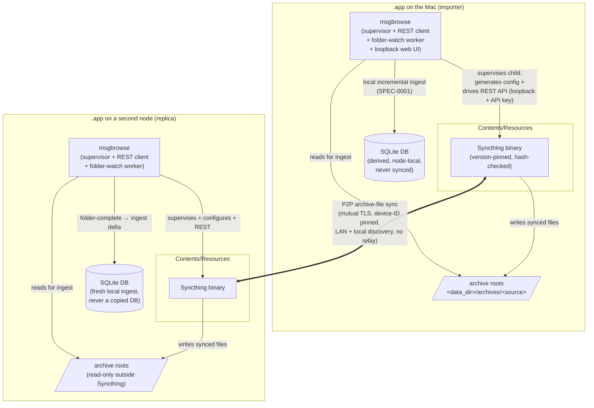

# SPEC-0014 Design: Syncthing-based device sync

## Context

[SPEC-0014](spec.md) implements
[ADR-0021](../../../adr/0021-syncthing-sync-engine.md): multi-device msgbrowse
via a **bundled, supervised Syncthing** as the transfer engine, replacing the
bespoke engine [SPEC-0011](../device-sync/spec.md) specified. The pivot is a
build-versus-buy reversal, not a change of shape — the same archive-sync model,
a different transport underneath.

What carries over unchanged from
[ADR-0018](../../../adr/0018-device-pairing-archive-sync.md) / SPEC-0011:

- **Archive-sync, not DB-replication.** Sync moves the archive *files*; each node
  runs its own [SPEC-0001](../ingestion/spec.md) ingest into its own SQLite. The
  database is never transferred. This is why file-level sync was always the right
  model — Syncthing just does the file-level part better than we would.
- **Importer/replica roles.** Only a node that can run the exporters (Signal
  Desktop key, Full Disk Access, phone backups — ADR-0015/ADR-0016) imports from
  live sources; replicas receive archives and ingest them. One importer per
  source. The topology is still single-writer-per-source, so there are still no
  conflicting writes to reconcile.
- **The re-ingest pipeline.** `internal/onboardsvc`'s incremental import (the
  Enable/Refresh runner) is the re-ingest primitive on every node, untouched by
  this pivot.

What Syncthing replaces (all the security-critical, bug-prone transport):

- msgbrowse-issued self-signed certificates pinned at pairing → Syncthing's
  device ID (SHA-256 of the device's TLS cert) and mutual TLS.
- Single-use TTL pairing tokens → a public device ID plus explicit both-ends
  acceptance.
- Per-source hash manifests, resumable byte-range transfer, staging with atomic
  adoption, bootstrap resume → Syncthing's block-level sync engine.
- mDNS/DNS-SD discovery, notify/poll convergence → Syncthing's local discovery
  and its always-on sync loop.

Expected touchpoints: a new `internal/syncthing` supervisor + REST/events client
package; config generation that maps managed archive roots to Syncthing folders;
the folder-watch → re-ingest worker; settings-page changes swapping the pairing
payload from a token to a device ID; a schema repurpose of `paired_devices` /
`sync_state`; the removal of `internal/devices` token/identity crypto and
`internal/devices/listener`; and `doctor` checks that read Syncthing's REST API.
The pure-Go `CGO_ENABLED=0` core (ADR-0013) is unaffected — Syncthing is a
separate process, not a linked dependency.

## Goals / Non-Goals

### Goals

- Pair a replica with an importer in one physical action (scan a QR of a device
  ID, or paste it) with no accounts, no CAs, no cloud, and no
  msgbrowse-issued certificates.
- Move archive trees — messages and media — reliably and resumably via
  Syncthing, then let each node's own ingest do the rest.
- Keep the loopback web UI posture unchanged; keep Syncthing's REST/GUI API on
  loopback with an API key; make device sync opt-in and doctor-observable, with
  the user never seeing Syncthing's own UI.

### Non-Goals

- **Global relay/discovery by default** — LAN + local discovery only in v1;
  cross-network relaying is an owner-gated opt-in, documented as internet egress.
- **Hand-editing Syncthing config** — msgbrowse owns config generation entirely.
- **Exposing Syncthing's GUI** — its state is surfaced through msgbrowse's own
  Settings/Status/doctor.
- **Database replication** — structurally excluded; the DB is derived, per-node.
- **Windows/Linux bundling in v1** — the transfer engine is cross-platform, but
  the `.app` bundle is macOS-first, owner-gated like the exporter bundle.

## Decisions

### Bundle-and-supervise over library-embed

**Choice**: Bundle the Syncthing binary under `Contents/Resources` and drive it
as a supervised child through its REST/events API, rather than embedding
Syncthing as a Go library linked into msgbrowse.
**Rationale**: Syncthing's internals are not a stable, supported embeddable API —
its module boundaries change between releases and it is designed to run as a
daemon, not as a library. Bundling the binary and driving the REST API gives a
stable contract (the documented REST/events API), an independent security-update
path (swap the binary, re-notarize), and process isolation. It also mirrors the
exporter-bundling pattern already established in
[ADR-0020](../../../adr/0020-bundled-exporters-guided-setup.md).
**Alternatives considered**: library-embed (rejected in v1 — no stable
embeddable API, couples msgbrowse's build and lifecycle to Syncthing internals;
kept as an Open Question for later); depend on user-installed Syncthing (rejected
by [ADR-0021](../../../adr/0021-syncthing-sync-engine.md) — breaks the
zero-config consumer app).

### msgbrowse owns config generation

**Choice**: msgbrowse generates Syncthing's entire config via the REST API —
folders are the managed archive roots under `<data_dir>/archives/<source>` with
ignore patterns excluding the DB and all `data_dir` state; devices are paired
peers — and the user never edits config or opens the GUI.
**Rationale**: Config generation is where the invariants are enforced (no DB in a
synced folder; exactly the managed roots and nothing else) and where the
zero-config promise lives. Owning it end-to-end means the user manages *sources
and peers*, never Syncthing folders and device blocks.
**Alternatives considered**: let the user configure Syncthing (rejected —
reintroduces the friction the desktop product removes, and lets a misconfigured
folder pull the DB into sync); a static shipped config (rejected — folders and
peers are inherently dynamic).

### Device-ID QR pairing over TTL tokens

**Choice**: The pairing QR/manual code carries this node's Syncthing device ID
plus a folder introduction — a public identifier, not a secret — and pairing
completes by adding the peer device and sharing folders via the REST API, gated
by Syncthing's both-ends device acceptance.
**Rationale**: Syncthing's device ID *is* the pinned-cert identity SPEC-0011 was
going to mint and pin; reusing it drops the entire token/TTL/rate-limit state
machine and the constant-time-compare replay defenses, because there is no secret
to leak or replay. Acceptance on both ends — not knowledge of the ID — gates
sync, so a captured QR is inert.
**Alternatives considered**: keep SPEC-0011's single-use TTL tokens (rejected —
solves a low-entropy-secret problem we no longer have, and adds a stateful
pairing window Syncthing already renders unnecessary); an msgbrowse-layer secret
on top of the device ID (rejected — redundant with Syncthing's acceptance step).

### Folder-watch trigger: REST events with an fsnotify fallback

**Choice**: Trigger re-ingest from Syncthing's REST/events API
folder-completion signals (`FolderCompletion` / `FolderSummary` events), with
`fsnotify` on the synced folder as a fallback, and gate re-ingest on the folder
being *complete* (not mid-transfer).
**Rationale**: The events API is the authoritative "this folder just reached
100%" signal and distinguishes completion from an in-flight transfer, which
`fsnotify` alone cannot — a naive filesystem watch would fire mid-sync and import
a partial archive. `fsnotify` is the belt-and-suspenders fallback if the event
stream drops. Gating on completion is what keeps the re-ingest from running
against a torn tree.
**Alternatives considered**: `fsnotify`-only (rejected — cannot tell completion
from mid-transfer, risks importing partial archives); polling the REST folder
summary on an interval (kept as a coarse fallback, not the primary trigger —
higher latency, wakes idle disks).

### Relay/discovery defaults: LAN-only

**Choice**: Generate Syncthing config with global discovery and relaying OFF,
local (LAN) discovery ON; global discovery/relay is an explicit owner opt-in.
**Rationale**: Global discovery and relays reach public internet servers, which
touches egress against
[ADR-0010](../../../adr/0010-security-privacy-posture.md). LAN-only keeps the
default posture "nothing leaves the LAN," matching the two-machines-in-one-house
use case; owners who genuinely need cross-network sync opt in knowingly.
**Alternatives considered**: relay-on by default (rejected — silent internet
egress inverts the privacy default); relay never (rejected — forecloses a
legitimate owner-gated use case).

## Architecture

Two views carry the design: the container topology (what bundles, supervises,
configures, and syncs), and the pairing sequence (device-ID QR → shared folder →
first import).

### Container diagram



### Pairing sequence

```mermaid
sequenceDiagram
    autonumber
    actor Owner
    participant UI as Importer web UI (loopback)
    participant RA as Importer msgbrowse<br/>(Syncthing REST client)
    participant SA as Importer Syncthing
    participant SB as Replica Syncthing
    participant RB as Replica msgbrowse

    Owner->>UI: Settings → Devices → "Pair a device"
    UI->>RA: Read this node's Syncthing device ID (REST)
    UI-->>Owner: QR + manual code {device ID, folder id(s), intro}
    Note over UI,Owner: Public device ID + folder intro — NOT a secret token
    Owner->>RB: Scan QR / paste device ID on the replica
    RB->>SB: Add importer's device ID as a peer (REST)
    Note over RB,SB: Replica now accepts the importer's device
    Owner->>RA: Approve the replica's device (or accept its intro request)
    RA->>SA: Add replica's device ID + share archive folder(s) (REST)
    Note over SA,SB: Both ends have now accepted each other's device ID
    SA->>SB: Mutual-TLS connect, device IDs pinned; folder shared
    SB->>SB: Sync archive files (block-level, resumable)
    SB-->>RB: FolderCompletion event (folder 100%)
    RB->>RB: Incremental import (SPEC-0001) of the synced archive
    RB-->>Owner: Messages appear (aria-live status)
```

## Risks / Trade-offs

- **Bundle size + Syncthing signing/notarization** → Syncthing is another
  embedded executable under `Contents/Resources`, adding to app size and to the
  Gatekeeper signing/notarization surface established by
  [ADR-0020](../../../adr/0020-bundled-exporters-guided-setup.md); every release
  signs and notarizes it alongside the exporters.
- **Supervising a third-party daemon** → msgbrowse owns Syncthing's lifecycle
  (clean start, graceful stop on app quit with no orphan, restart-with-backoff on
  crash) and must translate its REST/events model into msgbrowse status and
  `doctor`; a mapping layer to build and keep current across Syncthing versions.
- **Version pinning + security-update cadence** → we track Syncthing releases for
  security fixes and re-bundle + re-notarize to ship them, exactly as for the
  bundled exporters; the pinned hash makes the shipped version knowable and the
  update deliberate.
- **Retirement of #104/#105 code** → the merged pairing-token/identity crypto and
  the mTLS LAN listener are removed (sunk cost); only the QR/pairing UX shape and
  the schema tables carry forward, and the removal must leave no dangling pinned
  certificates or token windows.
- **Long-lived device IDs vs TTL tokens** → a device ID is durable, not
  time-boxed. This is safe because acceptance (not knowledge of the ID) gates
  sync, but it is a genuine trust-model change from SPEC-0011's ≤10-minute window
  and must be documented for operators.
- **Re-ingest against a partial tree** → mitigated by gating re-ingest on
  Syncthing's folder-completion event rather than a raw filesystem change, with
  overlapping events serialized per source so two imports never race one root.

## Migration Plan

1. **Retire the mTLS listener + token crypto.** Remove
   `internal/devices/listener` and the `internal/devices` pairing-token windows,
   self-signed identity, and versioned token payload (#104/#105). No
   msgbrowse-issued certificate is generated or pinned for device sync
   thereafter.
2. **Adapt the schema.** Repurpose `paired_devices` (peer's Syncthing device ID,
   device name, role-per-source, folder mapping) and `sync_state` (folder ↔
   source mapping, last-completed generation/summary as reported by Syncthing)
   rather than pinned fingerprints and byte-range cursors. A migration converts
   or clears any existing SPEC-0011 rows so no dangling pinned certs remain.
3. **New `internal/syncthing` supervisor package.** Bundle resolution +
   integrity check, child-process lifecycle (start/stop/backoff), config
   generation (folders from managed archive roots; devices from peers), a
   REST/events client (loopback + API key), and the folder-completion → re-ingest
   trigger driving `internal/onboardsvc`.
4. **Swap the pairing surface.** `/settings/devices` renders a device-ID QR +
   manual code instead of a token payload; pair/unpair drive the Syncthing REST
   API (add/remove device, share/unshare folder).
5. **Status + doctor.** Surface Syncthing's peer/folder state from its REST API
   into Settings/Logs/Status and add `doctor` checks (daemon running when
   enabled, peer connection state, folder completion/staleness, folder errors).
6. **Rollback.** Disable the config flag — the Syncthing child stops, no P2P
   listener remains, and the node reverts to the pure loopback posture.
   Already-synced archives stay browsable read-only; the sync-state tables sit
   inert.

## Open Questions

- **Library-embed feasibility later**: whether a future Syncthing offers a stable
  embeddable API worth linking in-process to shed the child-process supervision,
  and at what version.
- **Relay opt-in UX**: how to present the owner-gated global-discovery/relay
  toggle so its internet-egress implication is unmistakable, and whether it is
  ever appropriate for the default consumer path.
- **Headless/replica QR display**: how a node with no interactive UI (a home
  server) surfaces or consumes the device-ID pairing code — manual device-ID
  entry, a one-shot local page, or a CLI print.
- **Windows/Linux Syncthing bundling**: when the transfer engine (already
  cross-platform) gets an owner-gated bundle on those platforms, following the
  `.app` precedent.
- **Retaining #104 pairing primitives**: whether any of the retired
  `internal/devices` pairing UX helpers (QR rendering, manual-code encoding) are
  worth keeping in adapted form versus removing wholesale.
- **Ignore-pattern hardening**: the exact Syncthing ignore patterns that
  guarantee no `data_dir`/DB/WAL state can ever enter a synced folder, including
  when an archive root and `data_dir` share a parent.
