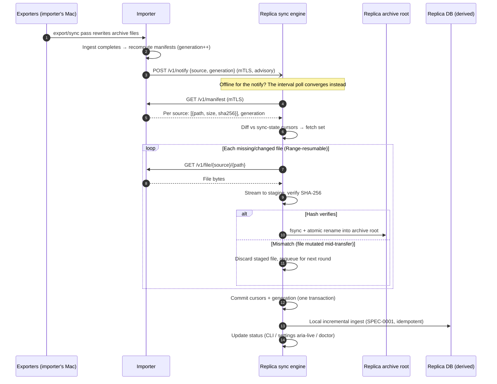

# SPEC-0011 Design: Device sync

## Context

[SPEC-0011](spec.md) implements
[ADR-0018](../../../adr/0018-device-pairing-archive-sync.md): multi-device
msgbrowse via archive synchronization, not database replication. The
constraints that shape everything here:

- Only the Mac can run the exporters (Signal Desktop key, Full Disk Access,
  phone backups — ADR-0015/ADR-0016), so per source there is exactly one
  producer. Sync is distribution, not reconciliation.
- Archives are read-only sources of truth and the DB is derived, idempotently
  re-ingestable state ([SPEC-0001](../ingestion/spec.md)) — the sync primitive
  ("copy files, re-ingest") already exists conceptually; this design makes it
  safe over a network.
- This is the first listener beyond loopback in an app whose security posture
  (ADR-0010) is built on never having one. The core stays pure-Go
  `CGO_ENABLED=0` (ADR-0013) — everything below is standard library TLS plus
  pure-Go dependencies.
- Media must travel with messages: the iMessage absolute-path saga showed what
  a text-without-media archive feels like, and it is the failure mode this
  feature exists to avoid.

Expected touchpoints: a new sync package, settings-page additions in
`internal/web` (the shared `/settings` Connect page —
[SPEC-0010 (desktop shell)](../desktop-shell/spec.md) — which renders this
spec's pairing QR and surfaces sync status), CLI commands, a small store
migration for sync-state tables, and `doctor` checks.

## Goals / Non-Goals

### Goals

- Pair a replica with an importer in one physical action (scan a QR or paste
  a code) with no accounts, CAs, or cloud services.
- Move archive trees — messages and media — verifiably and resumably over the
  LAN, then let each node's own ingest do the rest.
- Keep the loopback web UI posture byte-for-byte unchanged; make the new
  listener opt-in, mTLS-only, and doctor-observable.

### Non-Goals

- Internet/WAN sync — LAN only in v1; no relay, no hole punching.
- Multiple importers for the *same* source — structurally excluded.
- Selective or partial chat sync — v1 replicates whole archive roots.
- Mobile clients — desktop/server nodes only.

## Decisions

### Archive sync over DB replication

**Choice**: Replicate the archive file trees with hash manifests; every node
derives its own database locally.
**Rationale**: The archives already are the sync-shaped artifact — append-only,
single-writer, idempotently ingestable. File-level sync moves media for free,
never learns the schema, and makes DB migrations a node-local concern.
**Alternatives considered**:

| Alternative | Why rejected |
|---|---|
| Litestream / LiteFS | Single-writer WAL streaming to read replicas — wrong topology for peer devices, and media files never travel. |
| cr-sqlite (CRDTs) | Merges multi-writer databases; heavy dependency solving conflicts our single-importer-per-source topology structurally does not have. |
| Cloud relay / hosted E2EE service | Violates the local-only posture outright (ADR-0010). |
| External Syncthing | Works today, manually; but no pairing UX, no msgbrowse-aware verification, no doctor coverage. Documented as a DIY path, not the product. |

### Mutual TLS from pairing-pinned self-signed certificates

**Choice**: Each node generates a long-lived self-signed cert on enablement;
fingerprints exchange at pairing (QR carries the importer's, the pairing
request carries the replica's); all subsequent traffic is TLS 1.3 mutual auth
with exact fingerprint pinning.
**Rationale**: The QR/manual code is an out-of-band secure channel carrying a
full-entropy fingerprint, so we do not have the low-entropy-secret problem
PAKEs exist to solve. TLS is in the Go standard library (pure-Go, keeps
`CGO_ENABLED=0` sacred), gives durable peer identity for revocation, and gets
streaming, session management, and anti-replay for free.
**Alternatives considered**:

- PAKE (SPAKE2 / Magic-Wormhole style): excellent when the shared secret is a
  short human word-code, but it yields an ephemeral session — we would still
  need to mint and pin long-term identities afterward, which is exactly the
  cert step. Adds a dependency to solve a problem the QR already solved.
- Noise protocol framework: fine cryptography, but a vendored framework plus
  hand-rolled identity persistence, framing, and resumption — all things
  `crypto/tls` provides, audited, in the standard library.

### Dual discovery: QR-embedded endpoint + mDNS/DNS-SD

**Choice**: The QR/manual payload carries the importer's literal
`host:port`, which is used for pairing and stored as the peer's address;
sync-enabled nodes additionally advertise/browse a DNS-SD service type via
mDNS to re-find peers whose LAN address changed.
**Rationale**: mDNS does not cross VLANs or container network namespaces
reliably, so it can never be the only path — the literal endpoint always
works on the network where pairing happened. mDNS earns its keep afterward,
healing DHCP churn without user action.
**Alternatives considered**: mDNS-only (fails exactly when the user has
segmented their network — likely for this audience); static addresses only
(breaks silently on DHCP renewal; doctor can flag it, mDNS can fix it).

### Pull-based transfer with staging and atomic adoption

**Choice**: Replicas pull: fetch manifest, diff against local sync state,
GET files with Range resumption into a staging directory on the archive
root's filesystem, verify SHA-256, fsync, atomically rename into place;
ingest triggers only after the round's adoptions complete.
**Rationale**: Pull keeps all transfer state and backpressure on the node
that needs the data; resume is a byte offset, not a protocol negotiation.
Atomic rename means an archive path never holds a torn file, so SPEC-0001
ingest is safe at any instant. The importer's `/v1/notify` is a latency
optimization, deliberately advisory — losing every notification degrades to
the polling interval, never to missed data.
**Alternatives considered**: importer-push uploads (moves retry/resume state
onto the wrong node, and creates the unbounded-upload surface the security
section would then have to defend); rsync delegation (external binary,
no mTLS pinning integration, opaque verification).

### Single importer per source

**Choice**: Roles are recorded per source at pairing. Replicas refuse
manifest entries for a source from any peer other than its registered
importer; a second importer claim for a claimed source fails closed with an
error naming the incumbent.
**Rationale**: Matches reality (one Mac runs the exporters) and buys the
no-conflicts property the whole design leans on. Failing closed turns a
misconfiguration into a doctor-explainable error instead of interleaved
archive writes.
**Alternatives considered**: last-writer-wins adoption (silently corrupting —
two exporters' outputs interleaved in one root); no enforcement (same, later
and harder to debug).

### Node-local sync-state tables

**Choice**: A small set of sync-state tables in the existing SQLite DB: peer
registry (device name, role-per-source, pinned fingerprint, last-known
address), manifest cache with generation numbers, and transfer cursors.
Never synchronized — it is operational state about *this* node's view.
**Rationale**: Manifest diffs and bootstrap resume need durable cursors;
the DB is already there, migrated, and transactional. Keeping sync state out
of manifests preserves "DB is derived, archives are truth."
**Alternatives considered**: flat files in `data_dir` (reinvents transactions
for the cursor+generation atomicity the spec requires); embedding state in
the archive tree (violates read-only archives).

## Architecture

Two flows carry the whole design: the one-time pairing handshake, and the
steady-state sync round.

### Pairing handshake

```mermaid
sequenceDiagram
    autonumber
    actor Owner
    participant UI as Importer web UI (loopback)
    participant L as Importer sync listener (LAN, TLS)
    participant R as Replica

    Owner->>UI: Settings → Devices → "Pair a device"
    UI->>L: Open pairing window (single-use token, TTL ≤ 10 min)
    UI-->>Owner: QR + manual code {version, endpoint, token, cert SHA-256}
    Owner->>R: Scan QR / paste manual code on the replica
    R->>L: TLS connect; verify server cert == fingerprint from payload
    Note over R,L: Mismatch → abort before the token is ever transmitted
    R->>L: POST /v1/pair {token, device name, replica listener addr} + client cert
    L->>L: Validate token (single-use, unexpired, constant-time, rate-limited)
    L->>L: Pin replica cert fingerprint; persist peer (sync state)
    L-->>R: 200 {importer device name, served sources}
    R->>R: Pin importer cert fingerprint; persist peer
    L-->>UI: Window closes (token consumed)
    UI-->>Owner: "Paired" (aria-live status)
    Note over R,L: All future traffic: mutual TLS, exact pinned match, both directions
```

### Steady-state sync round



## Risks / Trade-offs

- **mDNS flakiness across VLANs and container networks** → the QR carries the
  literal endpoint, addresses are persisted at pairing and manually editable,
  and `doctor` distinguishes "peer unreachable at last-known address" from
  "not discoverable via mDNS."
- **Large first sync** (years of media can be tens of GB) → Range-resumable
  transfers with persisted per-file cursors; bootstrap survives restarts and
  reports real progress. Bandwidth caps are an open question, not a v1
  blocker.
- **Clock skew vs token TTL** → TTL is enforced solely against the issuing
  node's clock (it timestamps issuance and judges expiry), so peer skew
  cannot extend or shorten the window; only the displayed countdown is
  approximate.
- **Archive mutation during transfer** (an exporter pass rewrites `chat.md`
  mid-fetch) → manifests are computed only after an ingest pass completes,
  and every fetch is hash-verified against the manifest; a torn read fails
  verification, is discarded from staging, and re-queues for the next round.
  The archive root itself is never touched until rename time.
- **Replica disk usage** → full archive duplication per node is the explicit
  cost of media-complete sync; documented, surfaced in status, and the reason
  selective sync stays on the roadmap rather than in v1.
- **Certificate lifetime** → long-lived self-signed certs avoid renewal
  machinery in v1 but make expiry a slow-burning trap; `doctor` warns well
  ahead of expiry, and the rotation story is an open question.
- **New crypto/identity surface** → confined to stdlib TLS with pinning
  (no WebPKI, no CA logic); the pairing state machine is small, stateful, and
  race-tested per the spec's concurrency requirement.

## Migration Plan

1. **Config**: a new device-sync block (enabled flag, listener address, poll
   interval, staging location — key spellings provisional, see Open
   Questions). Absent block ⇒ feature fully off; no existing key changes
   meaning.
2. **Schema**: one migration adding the node-local sync-state tables (peers,
   manifest cache, cursors). No existing table changes; the tables are inert
   on nodes that never enable device sync.
3. **Surfaces**: settings gains the devices section; CLI gains pair/status/
   unpair commands; `doctor` gains the listener-posture, peer-reachability,
   cert-validity, staleness, and staging-leftover checks.
4. **Docs site**: a multi-device page covering pairing, the importer/replica
   model, disk expectations, and the manual-Syncthing alternative.
5. **Rollback**: disable the config flag — the listener stops, pairing
   windows invalidate, and the node reverts to the pure loopback posture.
   Already-synced archives remain browsable read-only; the sync-state tables
   sit inert.

## Open Questions

- **Windows timing**: importers are macOS by necessity; Linux/macOS replicas
  come first. When (and whether) a Windows replica is worth the path and
  fsync semantics work.
- **Bandwidth caps / transfer windows**: should big media syncs be throttled
  or schedulable (e.g. overnight), and does that change the v1 "no rate
  limits on mTLS endpoints" stance?
- **Replicas as importers for *different* sources**: roles are per source, so
  a second machine running the exporter for a source the Mac cannot produce
  looks structurally sound (multi-importer-per-distinct-source). Deliberately
  unvalidated in v1 — the enforcement only forbids two importers for the
  *same* source.
- **Naming**: the `sync` word is taken — `msgbrowse sync` is the ADR-0015
  export→import pipeline. The device-sync config block, CLI verbs, flag
  spellings, and web routes in these documents are placeholders pending a
  naming pass (e.g. a `device_sync` block and `msgbrowse device …`
  subcommands).
- **mDNS library**: which pure-Go mDNS/DNS-SD implementation (must keep
  `CGO_ENABLED=0`), and the service-type string to register.
- **Cert rotation**: renewal/re-pairing UX before long-lived certs expire;
  whether re-pairing is acceptable as the v1 rotation mechanism.
- **`.snapshots` handling**: the spec defaults the encrypted SQLCipher
  backups to excluded from manifests; confirm whether an opt-in to sync them
  (as opaque bytes) is wanted for off-Mac backup redundancy.
- **Default poll interval**: pick a fallback interval that balances
  convergence latency against waking disks on idle home servers.
