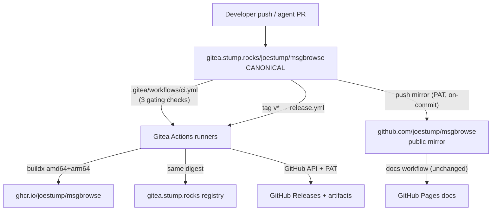

# Design: Gitea-primary development and GitHub publishing

## Context

msgbrowse currently lives on GitHub with three gating checks, a Pages-deployed
docs site, and no published artifacts. The owner runs Gitea 1.23 at
`gitea.stump.rocks` with Actions enabled (runners already serve other repos)
and a built-in OCI registry. ADR-0019 moves the canonical repo to Gitea while
keeping GitHub as the public, zero-churn distribution surface. Verified during
recon: the `joestump/msgbrowse` name is free on Gitea; Gitea credentials exist
on the dev host; the active `gh` token has repo scope (mirror + Releases), but
ghcr.io publishing needs a new PAT with `write:packages` — the only manual
step the owner must perform.

## Goals / Non-Goals

### Goals
- Canonical repo on owned infrastructure with full history parity.
- GitHub stays current automatically; Pages/Releases/ghcr.io all fed from Gitea.
- Release builds on self-hosted runners (native arm64, no hosted minutes).
- CI gating parity for Gitea PRs.

### Non-Goals
- Migrating issues/PR review to Gitea (separate future ADR; tracker stays GitHub).
- Homebrew taps, winget, or other package managers (future).
- Signing/notarization of desktop artifacts (deferred with SPEC-0010).

## Decisions

### Push mirror over pull mirror

**Choice**: Gitea push-mirror (sync-on-commit) to GitHub.
**Rationale**: makes Gitea unambiguously canonical; PAT-authenticated mirror
pushes still trigger GitHub workflows, so Pages and CI fire without changes.
**Alternatives considered**:
- GitHub-primary + Gitea pull-mirror: leaves ownership on GitHub (rejected by ADR-0019).
- External sync job (cron `git push`): reinvents what Gitea ships natively.

### Releases built on Gitea, published to GitHub

**Choice**: `.gitea/workflows/release.yml` builds on tag, pushes ghcr.io
images, and creates GitHub Releases via API.
**Rationale**: owned compute + native arm64; artifacts land where users look.
**Alternatives considered**:
- GitHub Actions building on mirrored tags: works, but puts release builds
  back on hosted runners — contradicts the driver.
- Publishing only to the Gitea registry: invisible to GitHub users.

### Two workflow dialects, minimal overlap

**Choice**: port the three gating checks to `.gitea/workflows/ci.yml`; GitHub
keeps its existing workflows untouched.
**Rationale**: Gitea Actions is workflow-compatible for these steps; GitHub
copies keep protecting mirror-side merges and external PRs.

## Architecture

## Risks / Trade-offs

- **PAT expiry silently breaks the mirror** → sync-status surfaced via a
  scheduled Gitea workflow that fails loudly when the mirror lags; docs cover
  rotation.
- **Workflow dialect drift** (`.github` vs `.gitea`) → keep ported workflows
  minimal and byte-similar; a comment header in each names its counterpart.
- **External contributors PR against GitHub** → documented reconcile flow
  (fetch GitHub PR → push branch to Gitea → merge there → mirror returns it).
- **Runner capacity** — release builds share runners with other repos; buildx
  with layer cache keeps tag builds short.

## Migration Plan

1. Create the Gitea repo (empty), push full history from the local clone.
2. Configure the push mirror with the PAT; verify mirrored push triggers
   GitHub Actions (Pages + checks).
3. Land `.gitea/workflows/ci.yml`; verify a Gitea PR gates.
4. Land `.gitea/workflows/release.yml`; owner adds the `write:packages` PAT
   secret; cut `v0.x.y` tag; verify ghcr.io image + GitHub Release.
5. Flip local remotes: `origin` → Gitea, `github` → mirror (read-only by
   convention).
6. Rollback: disable the mirror and push directly to GitHub again — no state
   is lost since GitHub always has full history.

## Open Questions

- Version scheme for the first tag (currently untagged; `v0.1.0`?).
- Whether Gitea Actions should also run the heavier adversarial-verify bots
  or leave that to the session tooling.
- Release-notes generation: hand-written vs conventional-commits derived.
