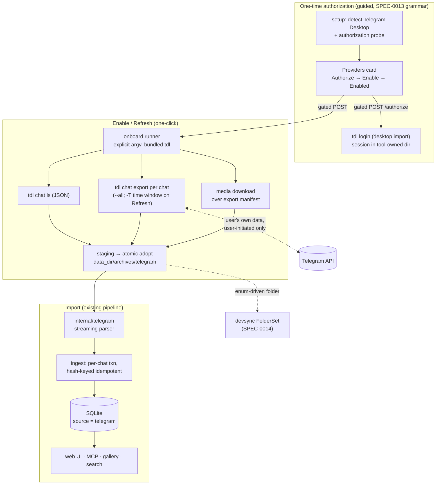

# SPEC-0015 Design: Telegram source

- **Capability:** telegram-source
- **Related ADRs:** [ADR-0022](../../../adr/0022-telegram-source-delegated-exporter.md), [ADR-0020](../../../adr/0020-bundled-exporters-guided-setup.md), [ADR-0016](../../../adr/0016-whatsapp-source-exporter.md), [ADR-0003](../../../adr/0003-dual-source-archive.md), [ADR-0010](../../../adr/0010-security-privacy-posture.md)

## Context

ADR-0022 selects `tdl` (iyear/tdl) as the delegated Telegram exporter and —
prompted by review of an earlier draft that would have had msgbrowse parse
Telegram Desktop's raw export directly — elevates the house idiom to an
invariant: **msgbrowse does not write exporters.** Extraction always belongs
to a dedicated, provider-targeted upstream tool; msgbrowse detects, guides,
invokes, and ingests. The import side rides every existing invariant:
hash-keyed idempotent ingest (SPEC-0001), traversal-safe media resolution,
the Providers detect → guide → import flow (SPEC-0013), the bundled-toolchain
discipline (ADR-0020: pinning, checksums, no `$PATH` fallback, relocation
probes), and enum-driven Syncthing folder provisioning (SPEC-0014). WhatsApp
(SPEC-0009) is the structural template; iMessage's single-binary bundling is
the packaging template.

## Goals / Non-Goals

### Goals
- One-click Enable/Refresh after a one-time guided authorization; genuinely
  incremental Refresh via the exporter's time-window filters.
- Full-fidelity import of what the exporter emits: text, media, service
  events, reactions, reply/forward metadata (tolerant where the exporter's
  schema evolves).
- First-class source parity: search filters, gallery, Providers card with
  counts/Disable/Refresh, doctor, MCP tools, device sync.
- Streaming parse — account-wide exports must import in bounded memory.

### Non-Goals
- No MTProto protocol code, no credential or session handling in msgbrowse
  (ADR-0022 invariant — the exporter owns its session).
- No secret-chat recovery (device-bound E2E; not exportable by any tool).
- No support for unpinned exporter versions: the parser targets the bundled,
  sha256-pinned `tdl` release; version bumps go through CI fixtures.
- No HTML-export parsing (rejected with the t-export option in ADR-0022 —
  HTML parsing would re-own a fragile provider format through the back
  door).

## Decisions

### Delegate to `tdl`, bundled like `imessage-exporter`

**Choice**: bundle the pinned `tdl` single static binary into
`Contents/Resources/tools`, resolved exclusively by the ADR-0020 toolchain
resolver; sha256 verified in CI alongside the existing three exporters, and
covered by the relocation-regression probe.
**Rationale**: strongest ecosystem fit (active, 7.7k★, JSON output,
incremental filters, desktop-session import); single-binary packaging is the
cheapest bundle addition and the signing pipeline already covers this shape.
**Alternatives considered**:
- `t-export` (RuslanUC): owner-suggested; rejected after evaluation — dormant
  since 2023, HTML-only output (JSON is an unimplemented TODO), no
  reactions/service messages, and Pyrogram login requires user-obtained
  `api_id`/`api_hash`. Documented in ADR-0022.
- Telethon-based dumpers: unmaintained; same api-credential friction.
- Direct parsing of Telegram Desktop's export: idiom violation (ADR-0022's
  rejected earlier draft).

### Exporter integration point mirrors the existing ExportArgs seam

**Choice**: `internal/onboard`'s source-resolver/exporter seam gains the
telegram case: chat enumeration (`tdl chat ls`, JSON output), per-chat export
(`tdl chat export -c <id> --all` shape, plus `-T time -i <anchor>,<now>` on
Refresh), and media download over the export manifest — each an explicit-argv
subprocess with the existing 32 KiB output ring into job logs. Exact flags
are verified against the pinned release during implementation (the spec pins
behavior, not flag spellings).
**Rationale**: the runner, staging, progress, and Logs machinery from
SPEC-0013 work unchanged; only the argv builder is new.

### One-time authorization with desktop-session import first

**Choice**: an Authorize card action runs the exporter's login with the
desktop-session import type against the detected Telegram Desktop
installation (non-interactive in the common case); a cheap non-destructive
probe (an exporter invocation that fails fast when unauthorized) gates the
card's transition to enable-ready. Interactive fallbacks (client passcode
set, no desktop client) get honest guided instructions; if embedding the
exporter's interactive flow proves unreasonable in v1, the guidance MAY
direct a one-time terminal step — explicitly better than msgbrowse touching
credentials.
**Rationale**: precedent alignment — signal-export leans on Signal Desktop's
keychain-held key material the same way; the session is the tool's, the
guidance is ours. The authorization-shaped failure classification reuses the
#181 pattern (classify → flip card to guidance → raw output in Logs).

### Staging layout and incremental anchors

**Choice**: staging root holds `chats.json` (the enumeration snapshot) plus
per-chat export JSON and a media directory per the exporter's output layout;
atomic adopt into `<data_dir>/archives/telegram`. The Refresh anchor is the
last successful import's max message timestamp per chat (msgbrowse-owned
state, already tracked by ingest), passed as the exporter's time-window
start. Overlap is harmless: content hashing dedupes.
**Rationale**: keeps the exporter stateless from msgbrowse's perspective and
makes Refresh cost proportional to new activity — a first among the four
sources.

### Parser package `internal/telegram`, streaming over the exporter's JSON

**Choice**: `internal/telegram` parses the exporter's JSON with
`json.Decoder` token-walking (one chat file / one message object at a time),
mirroring the importer shape of `internal/whatsapp`: unified model out,
ingest registration beside the others. Text flattening extracts links;
service entries map to `is_system`; reactions map to the existing reaction
model; unknown fields ignored; malformed entries logged + skipped.
Conversations key on `UNIQUE(source, name)` with the exported chat id
recorded; senders map to `contact_identifiers(source="telegram",
identifier=<user id>)` for manual reconciliation (ADR-0003).
**Rationale**: bounded memory on gigabyte exports; the unified-model seam is
why a fourth source is cheap.

## Architecture

## Risks / Trade-offs

- **Supply-chain dependency on `tdl` releases** → sha256 + version pinning
  (the #140 discipline), CI verification, fixtures re-run on every pin bump;
  the binary is signed with the bundle like every other tool.
- **Exporter JSON schema drift between pins** → tolerant decoding + versioned
  synthetic fixtures; drift surfaces in CI at pin-bump time, not at user
  runtime.
- **Authorization edge cases** (Telegram Desktop passcode, multi-account, no
  desktop client) → honest guided fallbacks; authorization-shaped failure
  classification re-enters guidance instead of dead-end "Failed" (the #181
  lesson).
- **Provider throttling (flood-wait) on large first exports** → the
  exporter's own backoff; msgbrowse surfaces per-chat progress and the job
  survives long waits; first-run copy sets expectations.
- **Account-safety posture** → exports use the user's own session at
  archival volumes, user-initiated only; no background/scheduled export in
  v1.
- **Identity fragmentation** (numeric user ids vs. phone-book contacts) →
  the standard manual reconciliation lane (ADR-0003); no automatic
  cross-source identity guessing.

## Migration Plan

One versioned schema migration extends the allowed-source check to include
`telegram` (transactional, `PRAGMA user_version` recorded). CI gains the
`tdl` pin + checksum + bundle step and includes it in the relocation probe.
No table shape changes. Rollout is feature-complete-or-absent: with no
authorization and no managed root, every surface behaves exactly as today.

## Open Questions

- Which cheap exporter invocation makes the best non-destructive
  authorization probe on the pinned release? (Implementation verifies; the
  spec only requires fail-fast-when-unauthorized.)
- Does the pinned `tdl` need a takeout-session flag for large-account
  exports, and does its backoff need tuning via flags? (Verify against the
  pinned release during story 2.)
- Linux desktop/browser-mode parity: the bundled tool ships in the macOS
  `.app`; `msgbrowse export`/CLI users on other platforms install `tdl`
  themselves — config parity exists via the standard exporter-bin flag
  convention. Confirm doctor hints cover that path.
