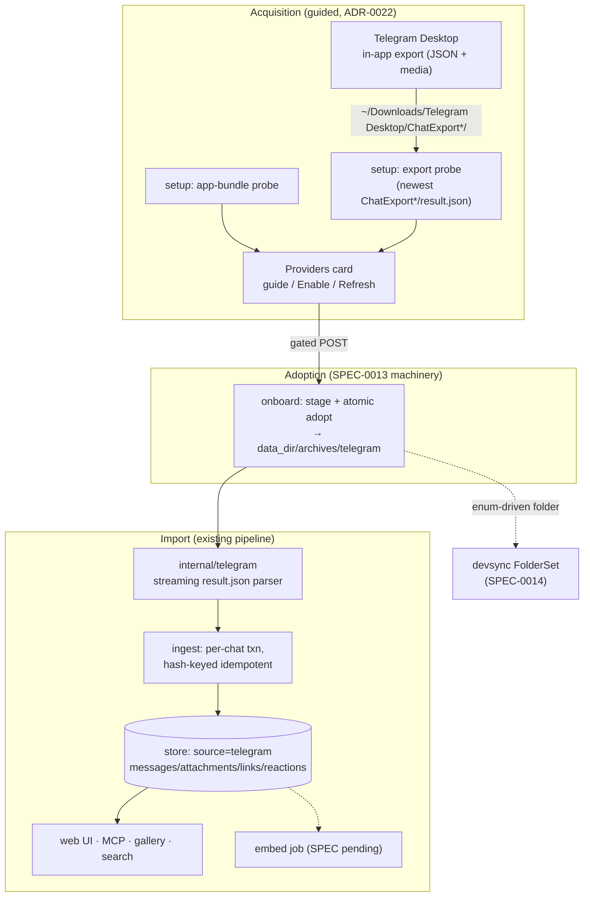

# SPEC-0015 Design: Telegram source

- **Capability:** telegram-source
- **Related ADRs:** [ADR-0022](../../../adr/0022-telegram-source-native-export.md), [ADR-0016](../../../adr/0016-whatsapp-source-exporter.md), [ADR-0003](../../../adr/0003-dual-source-archive.md), [ADR-0010](../../../adr/0010-security-privacy-posture.md)

## Context

ADR-0022 chose Telegram Desktop's first-party JSON export as the acquisition
path: no credentials, no bundled MTProto client, no new signing surface. The
import side is deliberately boring — Telegram becomes the fourth member of the
source enum and rides every existing invariant: hash-keyed idempotent ingest
(SPEC-0001), traversal-safe media resolution, the Providers detect → guide →
import flow (SPEC-0013), and enum-driven Syncthing folder provisioning
(SPEC-0014). WhatsApp (SPEC-0009) is the structural template: it too has a
"guided manual acquisition" leg (iPhone backup) and a parser package feeding
the shared pipeline.

## Goals / Non-Goals

### Goals
- Full-fidelity import of Telegram Desktop JSON exports: text (including
  entity arrays), media, service events, reactions, forwards/replies as
  metadata.
- First-class source parity: search filters, gallery, Providers card with
  counts/Disable/Refresh, doctor, MCP tools, device sync.
- Streaming parse — multi-GB `result.json` files must import in bounded
  memory.

### Non-Goals
- No MTProto client, no credential handling, no automated export (ADR-0022).
- No secret-chat recovery (Telegram Desktop does not export them).
- No HTML-export support (`result.json` only; the HTML export is a rendering
  of the same data with strictly less structure).
- No per-chat partial exports in v1 (the guided flow targets the full-account
  export; partial exports still parse, they just cover less).

## Decisions

### Parser package `internal/telegram`, mirrored on `internal/whatsapp`

**Choice**: a new `internal/telegram` package exposing the same importer
shape the other sources use (scan → parse → `[]signal.Message`-equivalent
unified model → ingest), registered in `internal/ingest` beside the others.
**Rationale**: the unified-model seam (ADR-0003) is the whole point of the
source enum; every downstream feature comes free.
**Alternatives considered**:
- A generic "JSON source" abstraction: rejected — one concrete consumer, and
  premature abstraction here has cost us before.

### Streaming token decode, not `ReadAll`

**Choice**: parse `result.json` with `json.Decoder` token-walking: seek into
`chats.list`, decode one chat header at a time, then decode messages within a
chat one object at a time.
**Rationale**: real exports are routinely gigabytes; the WhatsApp parser
already deals with a single large `result.json` and the memory ceiling was a
review finding there. One chat's messages at a time keeps the atomic
per-conversation transaction shape ingest expects.
**Alternatives considered**:
- `json.Unmarshal` the whole file: rejected — unbounded memory.
- External streaming-JSON dependency: rejected — stdlib `json.Decoder`
  suffices and keeps the dependency surface flat.

### Content hash and identity

**Choice**: message hash follows the house convention — a stable content hash
over (chat identity, sender, timestamp, flattened body, media ref) with the
existing sequence disambiguator for byte-identical repeats. Conversations key
on `UNIQUE(source, name)` with the exported chat `id` recorded; senders map to
`contact_identifiers(source="telegram", identifier=from_id)` for manual
reconciliation per ADR-0003.
**Rationale**: full re-exports must dedupe against prior imports without any
export-side incrementality; content hashing is how Signal/iMessage/WhatsApp
already solve exactly this.

### Detection and export discovery

**Choice**: detection probes (a) the Telegram Desktop app bundle
(`/Applications/Telegram.app`) or its user data directory, and (b) the
default export location — newest `ChatExport*` directory containing
`result.json` under `~/Downloads/Telegram Desktop/`. Both probes live in
`internal/setup` beside the Signal/WhatsApp probes, injectable for tests.
**Rationale**: mirrors the WhatsApp container glob approach — broad enough to
survive upstream renaming, narrow enough to never adopt an arbitrary folder.
**Alternatives considered**:
- Asking the user to type a path into the web UI: rejected — SPEC-0013 forbids
  client-supplied filesystem paths over HTTP.
- Desktop-native folder picker: deferred as an OPTIONAL enhancement; if added,
  the path flows through the in-process shell seam (like SetDetector), never
  an HTTP parameter.

### Guided flow, staged adoption

**Choice**: Enable stages the discovered export into
`<data_dir>/archives/telegram` (the enum-gated managed root) using the
existing staging + atomic-adopt machinery, then imports. When Telegram Desktop
is detected but no export exists, the card shows guidance with the exact
in-app steps (Settings → Advanced → Export Telegram data → format
"Machine-readable JSON", media on) and a Recheck affordance.
**Rationale**: identical UX grammar to WhatsApp's guided leg; staging keeps
the user's Downloads copy untouched (read-only posture) and makes Refresh a
re-probe + re-stage of a newer export.

### Reactions and rich message kinds

**Choice**: exported `reactions` arrays map to the reaction model shipped for
Signal/iMessage (badges, not rows). Forwarded/reply metadata is stored as
message metadata (rendered subtly, not blocking v1); calls/pins/joins are
service events → `is_system`. Stickers import as image attachments (they are
files in `stickers/`); animated variants fall back to file attachments when
the transcode layer cannot render them.
**Rationale**: reuse over invention — every one of these has an existing
lane.

## Architecture

## Risks / Trade-offs

- **Schema drift across Telegram Desktop releases** → tolerant parser
  (unknown fields ignored, malformed entries logged + skipped), versioned
  synthetic fixtures capturing the observed shapes, and a doctor hint when
  zero chats parse (likely a format change, not an empty account).
- **Multi-GB exports** → streaming decode (bounded memory), per-chat
  transactions, progress reported by chats-processed count.
- **User-side export friction (full re-export each refresh)** → honest copy
  on the card; Refresh re-probes Downloads so the user's loop is
  export-in-app → click Refresh.
- **Identity fragmentation** (`from_id` user IDs vs. phone-book contacts) →
  same manual reconciliation lane as every source (ADR-0003 contacts layer);
  no automatic cross-source identity guessing.
- **Adopting the wrong folder** (crafted or stale export in Downloads) →
  probes are read-only, staging validates `result.json` parses and the
  top-level shape matches before adopt; traversal-safe media resolution
  contains crafted paths.

## Migration Plan

One versioned schema migration extends the allowed-source check to include
`telegram` (transactional, `PRAGMA user_version` recorded, per house
convention). No table shape changes. Rollout is feature-complete-or-absent:
with no telegram root configured/adopted, every surface behaves exactly as
today.

## Open Questions

- Should the desktop shell add a native folder picker for non-default export
  locations in v1, or is the Downloads probe + doctor hint sufficient until
  someone hits it? (Deferred OPTIONAL in the spec.)
- Do current Telegram Desktop exports include per-message edit history, and
  if so do we surface edits? (Parser ignores unknown fields either way; can
  be a follow-up.)
